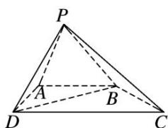

<!-- question-source:start -->
7. 如图，在四棱锥 $P - ABCD$ 中， $AB \parallel DC$ ， $\angle ADC = \frac{\pi}{2}$ ， $AB = AD = \frac{1}{2} CD = 2$ ， $PD = PB = \sqrt{6}$ ， $PD \perp BC$ .

(1)求证：平面 $PBD \perp$ 平面 PBC;

(2)在线段 $PC$ 上是否存在点 $M$ ，使得平面 $ABM$ 与平面 $PBD$ 的夹角为 $\frac{\pi}{3}$ ? 若存在，求出 $\frac{CM}{CP}$ 的值；若不存在，请说明理由.

<!-- question-source:end -->

![[高中/总复习/专题/立体几何/专题14 利用空间向量解决立体几何中的探索性问题-立体几何（理科）/考点02_探究线面的数量关系/对点训练/answers/Q00043836A1.md]]
