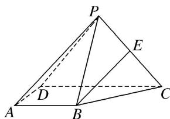

<!-- question-source:start -->
8. 已知在四棱锥 $P - ABCD$ 中，平面 $PDC \perp$ 平面 $ABCD$ ， $AD \perp DC$ ， $AB \parallel CD$ ， $AB = 2$ ， $DC = 4$ ， $E$ 为 $PC$ 的中点， $PD = PC$ ， $BC = 2\sqrt{2}$ .

(1)求证： $BE \parallel$ 平面 PAD;

(2)若 $PB$ 与平面 $ABCD$ 所成角为 $45^{\circ}$ , 点 $P$ 在平面 $ABCD$ 上的射影为 $O$ , 问: $BC$ 上是否存在一点 $F$ ,使平面 $POF$ 与平面 $PAB$ 所成的角为 $60^{\circ}$ ? 若存在, 试求点 $F$ 的位置; 若不存在, 请说明理由.

<!-- question-source:end -->

![[高中/总复习/专题/立体几何/专题14 利用空间向量解决立体几何中的探索性问题-立体几何（理科）/考点02_探究线面的数量关系/对点训练/answers/Q00043837A1.md]]
