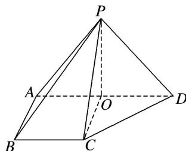

<!-- question-source:start -->
10. 如图所示，在四棱锥 $P - ABCD$ 中，侧面 $PAD \perp$ 底面 $ABCD$ ，侧棱 $PA = PD = \sqrt{2}$ ， $PA \perp PD$ ，底面 $ABCD$ 为直角梯形，其中 $BC \parallel AD$ ， $AB \perp AD$ ， $AB = BC = 1$ ， $O$ 为 $AD$ 的中点.

(1)求直线 PB 与平面 POC 所成角的余弦值;

(2)求 B 点到平面 PCD 的距离;

(3)线段 $PD$ 上是否存在一点 $Q$ ，使得二面角 $Q - AC - D$ 的余弦值为 $\frac{\sqrt{6}}{3}$ ? 若存在，求出 $\frac{PQ}{QD}$ 的值；若不存在，请说明理由.

<!-- question-source:end -->

![[高中/总复习/专题/立体几何/专题14 利用空间向量解决立体几何中的探索性问题-立体几何（理科）/考点02_探究线面的数量关系/对点训练/answers/Q00043839A1.md]]
