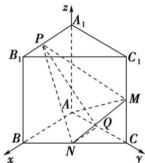

> [!faq]- 《专题14 利用空间向量解决立体几何中的探索性问题-立体几何（理科）》例题解析
>
> > [!success]- **【答案】** 详见解析
>
> > [!note]- **【分析】**
> > 本题未单列分析。
>
> > [!note]- **【解析】**
> > (1)证明：无论 $\lambda$ 取何值，总有 $AM \perp$ 平面 $PNQ$ ;
> > (2)是否存在点 $P$ ，使得平面 $PMN$ 与平面 $ABC$ 的夹角为 $60^{\circ}$ ? 若存在，试确定点 $P$ 的位置，若不存在，请说明理由.
> > 
> > 5. 解析 (1)如图，以 $A$ 为坐标原点， $AB, AC, AA_1$ 所在的直线分别为 $x$ 轴、 $y$ 轴、 $z$ 轴建立空间直角坐标系，则 $A(0, 0, 0), A_1(0, 0, 1), B_1(1, 0, 1), M\left[0, 1, \frac{1}{2}\right], N\left[\frac{1}{2}, \frac{1}{2}, 0\right], Q\left[0, \frac{1}{2}, 0\right]$ ，
> > 由 $\overrightarrow{A_{1}P}=\lambda\overrightarrow{A_{1}B_{1}}=\lambda(1,0,0)=(\lambda,0,0)$ ，可得点 $P(\lambda,0,1)$ ，所以 $\overrightarrow{PN}=\left(\frac{1}{2}-\lambda,\frac{1}{2},-1\right)$ ， $\overrightarrow{PQ}=\left(-\lambda,\frac{1}{2},-1\right)$ .
> > 又 $\overrightarrow{AM}=\left(0,1,\frac{1}{2}\right)$ ，所以 $\overrightarrow{AM}\cdot\overrightarrow{PN}=0+\frac{1}{2}-\frac{1}{2}=0,\quad\overrightarrow{AM}\cdot\overrightarrow{PQ}=0+\frac{1}{2}-\frac{1}{2}=0,$
> > 所以 $\overrightarrow{AM}\perp\overrightarrow{PN},\quad\overrightarrow{AM}\perp\overrightarrow{PQ}$ ，即 $AM\perp PN,\quad AM\perp PQ,$
> > 又 $PN \cap PQ = P$ ，所以 $AM \perp$ 平面 $PNQ$ ，所以无论 $\lambda$ 取何值，总有 $AM \perp$ 平面 $PNQ$ .
> > 
> > (2)设 $\boldsymbol{n}=(x,y,z)$ 是平面 PMN 的法向量， $\overrightarrow{NM}=\left(-\frac{1}{2},\frac{1}{2},\frac{1}{2}\right)$ ， $\overrightarrow{PN}=\left(\frac{1}{2}-\lambda,\frac{1}{2},-1\right)$ ,
> > 则 $\left\{ \begin{array}{l} n \cdot \overrightarrow{NM} = 0, \\ n \cdot \overrightarrow{PN} = 0, \end{array} \right.$ 即 $\left\{ \begin{array}{l} -\frac{1}{2} x + \frac{1}{2} y + \frac{1}{2} z = 0, \\ \left( \frac{1}{2} - \lambda \right)x + \frac{1}{2} y - z = 0, \end{array} \right.$ 得 $\left\{ \begin{array}{l} y = \frac{1 + 2\lambda}{3} x, \\ z = \frac{2 - 2\lambda}{3} x, \end{array} \right.$
> > 令 x=3，所以 $n=(3,1+2\lambda,2-2\lambda)$ 是平面 PMN 的一个法向量.
> > 取平面 ABC 的一个法向量为 $m=(0,0,1)$ .
> > 假设存在符合条件的点 $P$ ，则 $\left|\cos < m, n > \right| = \frac{|2 - 2\lambda|}{\sqrt{9 + 1 + 2\lambda^2 + 2 - 2\lambda^2}} = \frac{1}{2},$
> > 化简得 $4\lambda^2 - 14\lambda + 1 = 0$ ，解得 $\lambda = \frac{7 - 3\sqrt{5}}{4}$ 或 $\lambda = \frac{7 + 3\sqrt{5}}{4}$ (舍去).
> > 综上，存在点 $P$ ，且当 $A_{1}P = \frac{7 - 3\sqrt{5}}{4}$ 时，满足平面PMN与平面ABC的夹角为 $60^{\circ}$
