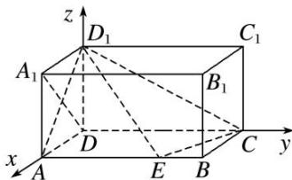

> [!faq]- 《专题14 利用空间向量解决立体几何中的探索性问题-立体几何（理科）》例题解析
>
> > [!success]- **【答案】** 详见解析
>
> > [!note]- **【分析】**
> > 本题未单列分析。
>
> > [!note]- **【解析】**
> > (1)求证： $D_{1}E \perp A_{1}D;$
> > (2)在棱 $AB$ 上是否存在点 $E$ 使得 $AD_{1}$ 与平面 $D_{1}EC$ 所成的角为 $\frac{\pi}{6}$ ? 若存在, 求出 $AE$ 的长, 若不存在,说明理由.
> > 
> > 1. 解析
> > (1)∵ $AE \perp$ 平面 $AA_{1}D_{1}D$ ， $A_{1}D \subset$ 平面 $AA_{1}D_{1}D$ ，∴ $AE \perp A_{1}D$ .
> > ∵在长方体 $ABCD-A_{1}B_{1}C_{1}D_{1}$ 中， $AD=AA_{1}=1,\quad\therefore A_{1}D\perp AD_{1}$
> > $\because AE\cap AD_{1}=A,\quad\therefore A_{1}D\perp\text{平面}AED_{1}.\quad\because D_{1}E\subset\text{平面}AED_{1},\quad\therefore D_{1}E\perp A_{1}D.$
> > (2)以 D 为坐标原点，DA，DC， $DD_{1}$ 所在直线分别为 x，y，z 轴，建立空间直角坐标系，如图所示.
> > 
> > 设棱 AB 上存在点 $E(1, t, 0) (0 \leqslant t \leqslant 2)$ ，使得 $AD_{1}$ 与平面 $D_{1}EC$ 所成的角为 $\frac{\pi}{6}$ ,
> > $A(1, 0, 0), D_1(0, 0, 1), C(0, 2, 0), \overrightarrow{AD}_1 = (-1, 0, 1), \overrightarrow{CD}_1 = (0, -2, 1), \overrightarrow{CE} = (1, t-2, 0)$ ,
> > 设平面 $D_1EC$ 的法向量为 $n = (x, y, z)$ ，则 $\left\{ \begin{array}{l} n \cdot \overrightarrow{CD}_1 = -2y + z = 0, \\ n \cdot \overrightarrow{CE} = x + (t-2)y = 0, \end{array} \right.$ 取 $y = 1$ ，得 $n = (2-t, 1, 2)$ , $\therefore \sin \frac{\pi}{6} = \frac{|\overrightarrow{AD}_1 \cdot n|}{|\overrightarrow{AD}_1||n|} = \frac{|t-2+2|}{\sqrt{2 \times \sqrt{(t-2)^2+5}}}$ ，整理，得 $t^2 + 4t - 9 = 0$ ，解得 $t = \sqrt{13} - 2$ 或 $t = -2 - \sqrt{13}$ （舍去）， $\therefore$ 在棱 $AB$ 上存在点 $E$ 使得 $AD_1$ 与平面 $D_1EC$ 所成的角为 $\frac{\pi}{6}$ ，此时 $AE = \sqrt{13} - 2$ .
