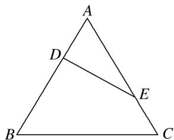
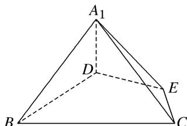
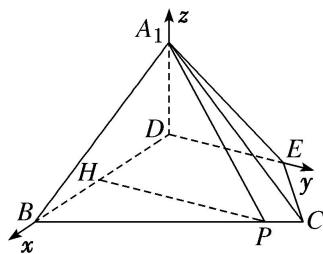

> [!faq]- 《专题14 利用空间向量解决立体几何中的探索性问题-立体几何（理科）》例题解析
>
> > [!success]- **【答案】** 详见解析
>
> > [!note]- **【分析】**
> > 本题未单列分析。
>
> > [!note]- **【解析】**
> > (1)求证： $A_{1}D\perp$ 平面BCED；
> > (2)在线段 BC 上是否存在点 P，使直线 $PA_{1}$ 与平面 $A_{1}BD$ 所成的角为 $60^{\circ}$ ？若存在，求出 PB 的长；若不存在，请说明理由.
> > 
> > 
> > 图①
> > 图②
> > 2. 解析
> > (1)题图①中, 由已知可得: $AE = 2$ , $AD = 1$ , $A = 60^{\circ}$ .
> > 从而 $DE=\sqrt{1^{2}+2^{2}-2\times1\times2\times\cos60^{\circ}}=\sqrt{3}$ . 故得 $AD^{2}+DE^{2}=AE^{2}$ ,
> > 所以 $AD \perp DE$ ， $BD \perp DE$ ．所以题图②中， $A_{1}D \perp DE$ ，
> > 又平面 $ADE \cap$ 平面 BCED = DE, $A_{1}D \perp DE$ , $A_{1}D \subset$ 平面 $A_{1}DE$ ，所以 $A_{1}D \perp$ 平面 BCED.
> > (2)存在．由
> > (1)知 $ED \perp DB$ ， $A_{1}D \perp$ 平面 BCED．以 D 为坐标原点，以射线 DB，DE， $DA_{1}$ 分别为 x 轴，y 轴，z 轴的正半轴建立空间直角坐标系 D-xyz，如图，
> > 
> > 过 P 作 $PH \parallel DE$ 交 BD 于点 H，设 $PB = 2a (0 \leq 2a \leq 3)$ ，则 BH = a， $PH = \sqrt{3}a$ ，DH = 2 - a，
> > 易知 $A_{1}(0, 0, 1)$ ， $P(2-a, \sqrt{3}a, 0)$ ， $E(0, \sqrt{3}, 0)$ ，所以 $\overrightarrow{PA_{1}} = (a - 2, -\sqrt{3}a, 1)$ .
> > 因为 $ED \perp$ 平面 $A_{1}BD$ ，所以平面 $A_{1}BD$ 的一个法向量为 $\overrightarrow{DE} = (0, \sqrt{3}, 0)$ ,
> > 因为直线 $PA_{1}$ 与平面 $A_{1}BD$ 所成的角为 $60^{\circ}$ ,
> > 所以 $\sin60^{\circ}=\frac{|\overrightarrow{PA_{1}}\cdot\overrightarrow{DE}|}{|\overrightarrow{PA_{1}}||\overrightarrow{DE}|}=\frac{3a}{\sqrt{4a^{2}-4a+5}\times\sqrt{3}}=\frac{\sqrt{3}}{2}$ ，解得 $a=\frac{5}{4}$ .
> > 所以 $PB = 2a = \frac{5}{2}$ ，满足 $0 \leq 2a \leq 3$ ，符合题意。
> > 所以在线段 BC 上存在点 P，使直线 $PA_{1}$ 与平面 $A_{1}BD$ 所成的角为 $60^{\circ}$ ，此时 $PB=\frac{5}{2}$ .
