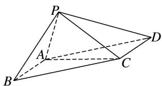
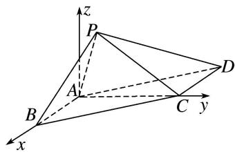

> [!faq]- 《专题14 利用空间向量解决立体几何中的探索性问题-立体几何（理科）》例题解析
>
> > [!success]- **【答案】** 详见解析
>
> > [!note]- **【分析】**
> > 本题未单列分析。
>
> > [!note]- **【解析】**
> > (1)求证：平面 $PAB \perp$ 平面 PAC;
> > (2)若 $\angle PBA = 45^{\circ}$ , 试判断棱 $PA$ 上是否存在与点 $P$ , $A$ 不重合的点 $E$ , 使得直线 $CE$ 与平面 $PBC$ 所成角的正弦值为 $\frac{\sqrt{6}}{9}$ ? 若存在, 求出 $\frac{AE}{AP}$ 的值; 若不存在, 请说明理由.
> > 
> > 3. 解析
> > (1) 因为四边形 ABCD 是平行四边形， $AD=2\sqrt{2}$ ，所以 $BC=AD=2\sqrt{2}$ ，
> > 又 $AB = AC = 2$ ，所以 $AB^{2} + AC^{2} = BC^{2}$ ，所以 $AC \perp AB$
> > 又 $PB \perp AC$ ， $AB \cap PB = B$ ，AB， $PB \subset$ 平面 PAB，所以 $AC \perp$ 平面 PAB.
> > 又因为 $AC \subset$ 平面 PAC，所以平面 $PAB \perp$ 平面 PAC.
> > (2)由
> > (1)知 $AC \perp AB$ ， $AC \perp$ 平面 PAB，分别以 AB，AC 所在直线为 x 轴，y 轴，
> > 平面 PAB 内过点 A 且与直线 AB 垂直的直线为 z 轴，建立空间直角坐标系 Axyz，
> > 
> > 则 $A(0, 0, 0)$ ， $B(2, 0, 0)$ ， $C(0, 2, 0)$ ， $\overrightarrow{AC}=(0, 2, 0)$ ， $\overrightarrow{BC}=(-2, 2, 0)$ ，
> > 由 $\angle PBA=45^{\circ}$ ， $PB=\sqrt{2}$ ，可得 $P(1,0,1)$ ，所以 $\overrightarrow{AP}=(1,0,1)$ ， $\overrightarrow{BP}=(-1,0,1)$ ，
> > 假设棱 PA 上存在点 E，使得直线 CE 与平面 PBC 所成角的正弦值为 $\frac{\sqrt{6}}{9}$ ,
> > 设 $\frac{AE}{AP}=\lambda(0<\lambda<1)$ ，则 $\overrightarrow{AE}=\lambda\overrightarrow{AP}=(\lambda,0,\lambda)$ ， $\overrightarrow{CE}=\overrightarrow{AE}-\overrightarrow{AC}=(\lambda,-2,\lambda)$
> > 设平面 PBC 的法向量 $\boldsymbol{n}=(x,y,z)$ ，则 $\left\{\begin{aligned}\boldsymbol{n}\cdot\overrightarrow{BC}&=0,\\ \boldsymbol{n}\cdot\overrightarrow{BP}&=0,\end{aligned}\right.$ 即 $\left\{\begin{aligned}-2x+2y&=0,\\ -x+z&=0,\end{aligned}\right.$
> > 令 z=1，可得 x=y=1，所以平面 PBC 的一个法向量 $n=(1,1,1)$ ,
> > 设直线 CE 与平面 PBC 所成的角为 $\theta$ ，则
> > $\sin \theta = |\cos < n, \vec{CE} | = \frac{|\lambda - 2 + \lambda|}{\sqrt{3} \cdot \sqrt{\lambda^2 + (-2)^2 + \lambda^2}} = \frac{|2\lambda - 2|}{\sqrt{3} \cdot \sqrt{2\lambda^2 + 4}} = \frac{\sqrt{6}}{9}$ , 解得 $\lambda = \frac{1}{2}$ 或 $\lambda = \frac{7}{4}$ (舍).
> > 所以在棱 PA 上存在点 E，且 $\frac{AE}{AP} = \frac{1}{2}$ ，使得直线 CE 与平面 PBC 所成角的正弦值为 $\frac{\sqrt{6}}{9}$ .
