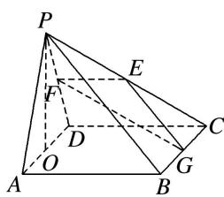
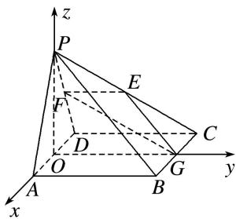

> [!faq]- 《专题14 利用空间向量解决立体几何中的探索性问题-立体几何（理科）》例题解析
>
> > [!success]- **【答案】** 详见解析
>
> > [!note]- **【分析】**
> > 本题未单列分析。
>
> > [!note]- **【解析】**
> > (1)求证： $PO \perp$ 平面 ABCD;
> > (2)求平面 EFG 与平面 ABCD 所成锐二面角的大小;
> > (3)在线段 $PA$ 上是否存在点 $M$ ，使得直线 $GM$ 与平面 $EFG$ 所成角为 $\frac{\pi}{6}$ ，若存在，求线段 $PM$ 的长度；若不存在，说明理由.
> > 
> > 4. 解析
> > (1) 因为 $\triangle PAD$ 是正三角形, $O$ 是 $AD$ 的中点, 所以 $PO \perp AD$ . 又因为 $CD \perp$ 平面 $PAD$ , $PO \subset$ 平面 $PAD$ , 所以 $PO \perp CD$ . 又 $AD \cap CD = D$ , $AD$ , $CD \subset$ 平面 $ABCD$ , 所以 $PO \perp$ 平面 $ABCD$ .
> > (2)如图，以 O 点为原点，分别以 OA, OG, OP 所在直线为 x 轴、y 轴、z 轴建立空间直角坐标系 O-xyz. 则 $O(0, 0, 0)$ , $A(2, 0, 0)$ , $B(2, 4, 0)$ , $C(-2, 4, 0)$ , $D(-2, 0, 0)$ , $G(0, 4, 0)$ , $P(0, 0, 2\sqrt{3})$ , $E(-1, 2, \sqrt{3})$ , $F(-1, 0, \sqrt{3})$ , $\vec{EF} = (0, -2, 0)$ , $\vec{EG} = (1, 2, -\sqrt{3})$ ,
> > 
> > 设平面 EFG 的法向量为 $\boldsymbol{m}=(x,y,z)$ ，则 $\left\{\begin{aligned}\vec{EF}\cdot\boldsymbol{m}&=0,\\ \vec{EG}\cdot\boldsymbol{m}&=0,\end{aligned}\right.$ 即 $\left\{\begin{aligned}-2y&=0,\\ x+2y-\sqrt{3}z&=0,\end{aligned}\right.$
> > 令 z=1，则 $m=(\sqrt{3},0,1)$ ，又平面 ABCD 的法向量 $n=(0,0,1)$ ,
> > 设平面 $EFG$ 与平面 $ABCD$ 所成锐二面角为 $\theta$ ，所以 $\cos \theta = \frac{|\pmb{m} \cdot \pmb{n}|}{|\pmb{m}||\pmb{n}|} = \frac{1}{\sqrt{(\sqrt{3})^2 + 1^2} \times 1} = \frac{1}{2}$ .
> > 所以平面 EFG 与平面 ABCD 所成锐二面角为 $\frac{\pi}{3}$ .
> > (3)假设在线段 $PA$ 上存在点 $M$ ，使得直线 $GM$ 与平面 $EFG$ 所成角为 $\frac{\pi}{6}$ ，
> > 即直线 GM 的方向向量与平面 EFG 法向量 m 所成的锐角为 $\frac{\pi}{3}$ ,
> > 设 $\overrightarrow{PM}=\lambda\overrightarrow{PA},\quad\lambda\in[0,1],\quad\overrightarrow{GM}=\overrightarrow{GP}+\overrightarrow{PM}=\overrightarrow{GP}+\lambda\overrightarrow{PA},\quad所以\overrightarrow{GM}=(2\lambda,-4,2\sqrt{3}-2\sqrt{3}\lambda),$
> > 所以 $\cos\frac{\pi}{3}=|\cos<\overrightarrow{GM},\quad m>|=\frac{\sqrt{3}}{2\sqrt{4\lambda^{2}-6\lambda+7}}$ ，整理得 $2\lambda^{2}-3\lambda+2=0$ ，
> > $\Delta<0$ ，方程无解，所以，不存在这样的点M.
