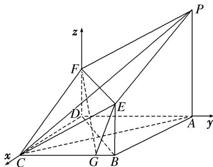

> [!faq]- 《专题14 利用空间向量解决立体几何中的探索性问题-立体几何（理科）》例题解析
>
> > [!success]- **【答案】** 详见解析
>
> > [!note]- **【分析】**
> > 本题未单列分析。
>
> > [!note]- **【解析】**
> > (1)求证：平面 $APC \perp$ 平面 PECF;
> >
> > (2)设 $\overrightarrow{BG}=\lambda\overrightarrow{BC}(0\leq\lambda\leq1)$ ，当 $\lambda$ 为何值时，平面EFG与平面ABCD所成的角为 $\frac{\pi}{3}$ ?
> >
> > 
> >
> > 6. 解析
> > (1)由已知可知， $EB \parallel FD$ ，且 EB = FD，如图，连接 BD，则四边形 EFDB 是平行四边形，
> > ∴EF∥BD．∵底面ABCD为正方形，∴BD⊥AC．∵AP⊥底面ABCD，∴BD⊥AP.
> > 又 $AC \cap AP = A$ ，∴ $BD \perp$ 平面 APC，∴ $EF \perp$ 平面 APC.
> >
> > ∵EF⊂平面 PECF，∴平面 APC⊥平面 PECF.
> >
> > 
> >
> > (2)以 D 为原点建立如图所示的空间直角坐标系 D-xyz,
> >
> > 则 $B(2, 2, 0), F(0, 0, 1), E(2, 2, 1), G(2, 2 - 2\lambda, 0), \overrightarrow{FE} = (2, 2, 0), \overrightarrow{GE} = (0, 2\lambda, 1)$ ,
> >
> > 设 $\boldsymbol{m}=(x,y,z)$ 是平面 EFG 的法向量，故 $\left\{\begin{aligned}\mathrm{m}\cdot\overrightarrow{FE}&=0,\\ m\cdot\overrightarrow{GE}&=0,\end{aligned}\right.$ 即 $\left\{\begin{aligned}x&=-y,\\ z&=-2\lambda y,\end{aligned}\right.$
> >
> > 令 y = -1，可得 $m = (1, -1, 2\lambda)$ 为平面 EFG 的一个法向量，
> >
> > 而平面 ABCD 的一个法向量为 $n=(0,0,1)$ .
> >
> > 于是 $\cos \frac{\pi}{3} = |\cos < m, n > | = \frac{|2\lambda|}{\sqrt{2 + 4\lambda^2}}$ ，解得 $\lambda = \pm \frac{\sqrt{6}}{6}$ ，又 $0 \leq \lambda \leq 1$ ， $\therefore \lambda = \frac{\sqrt{6}}{6}$ .
