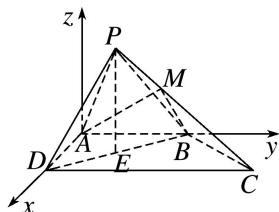

> [!faq]- 《专题14 利用空间向量解决立体几何中的探索性问题-立体几何（理科）》例题解析
>
> > [!success]- **【答案】** 详见解析
>
> > [!note]- **【分析】**
> > 本题未单列分析。
>
> > [!note]- **【解析】**
> > (1)求证：平面 $PBD \perp$ 平面 PBC;
> > (2)在线段 $PC$ 上是否存在点 $M$ ，使得平面 $ABM$ 与平面 $PBD$ 的夹角为 $\frac{\pi}{3}$ ? 若存在，求出 $\frac{CM}{CP}$ 的值；若不存在，请说明理由.
> > 
> > 7. 解析
> > (1)因为四边形 $ABCD$ 为直角梯形，且 $AB \parallel DC$ ， $AB = AD = 2$ ， $\angle ADC = \frac{\pi}{2}$ ，所以 $BD = 2\sqrt{2}$ ，又因为 $CD = 4$ ， $\angle BDC = \frac{\pi}{4}$ . 根据余弦定理得 $BC = 2\sqrt{2}$ ，所以 $CD^2 = BD^2 + BC^2$ ，故 $BC \perp BD$ .
> > 又因为 $BC \perp PD$ ， $PD \cap BD = D$ ，且 BD， $PD \subset$ 平面 PBD，所以 $BC \perp$ 平面 PBD，
> > 又因为 $BC \subset$ 平面 PBC，所以平面 $PBC \perp$ 平面 PBD.
> > (2)由
> > (1)得平面 $ABCD \perp$ 平面 PBD，设 E 为 BD 的中点，连接 PE，
> > 因为 $PB = PD = \sqrt{6}$ ，所以 $PE \perp BD$ ，PE = 2，
> > 又平面 $ABCD \perp$ 平面 PBD，平面 $ABCD \cap$ 平面 PBD = BD， $PE \subset$ 平面 PBD，所以 $PE \perp$ 平面 ABCD.
> > 如图，以 A 为原点，分别以 $\overrightarrow{AD}$ ， $\overrightarrow{AB}$ 和垂直平面 ABCD 的方向为 x，y，z 轴正方向，建立空间直角坐标系，
> > 
> > 则 $A(0, 0, 0)$ ， $B(0, 2, 0)$ ， $C(2, 4, 0)$ ， $D(2, 0, 0)$ ， $P(1, 1, 2)$ ，
> > 假设存在 $M(a, b, c)$ 满足要求，设 $\frac{CM}{CP} = \lambda (0 \leqslant \lambda \leqslant 1)$ ，即 $\overrightarrow{CM} = \lambda \overrightarrow{CP}$ ，
> > 所以 $M(2-\lambda, 4-3\lambda, 2\lambda)$ ，易得平面 PBD 的一个法向量为 $\overrightarrow{BC}=(2, 2, 0)$ .
> > 设 $n = (x, y, z)$ 为平面 $ABM$ 的一个法向量， $\overrightarrow{AB} = (0, 2, 0)$ ， $\overrightarrow{AM} = (2 - \lambda, 4 - 3\lambda, 2\lambda)$ .
> > 由 $\left\{\begin{aligned}n\cdot\overrightarrow{AB}&=0,\\ n\cdot\overrightarrow{AM}&=0,\end{aligned}\right.$ 得 $\left\{\begin{aligned}2y&=0,\\ (2-\lambda)x+(4-3\lambda)y+2\lambda z&=0,\end{aligned}\right.$ 不妨取 $n=(2\lambda,0,\lambda-2)$ .
> > 因为平面 PBD 与平面 ABM 的夹角为 $\frac{\pi}{3}$ ，所以 $\frac{|4\lambda|}{2\sqrt{2}\sqrt{4\lambda^{2}+(\lambda-2)^{2}}}=\frac{1}{2}$ ,
> > 解得 $\lambda = \frac{2}{3}$ ， $\lambda = -2$ (不合题意舍去). 故存在 $M$ 点满足条件，且 $\frac{CM}{CP} = \frac{2}{3}$ .
