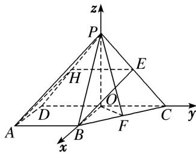

> [!faq]- 《专题14 利用空间向量解决立体几何中的探索性问题-立体几何（理科）》例题解析
>
> > [!success]- **【答案】** 详见解析
>
> > [!note]- **【解析】**
> > 解析
> > (1)取 $PD$ 的中点 $H$ , 连接 $AH$ , $EH$ , 则 $EH \parallel CD$ , $EH = \frac{1}{2} CD$ ,
> >
> > 又 $AB \parallel CD$ ， $AB = \frac{1}{2} CD = 2$ ， $\therefore EH \parallel AB$ ，且 $EH = AB$ ，
> >
> > ∴四边形 ABEH 为平行四边形，故 BE // HA．又 BE ≠ 平面 PAD，HA ⊂ 平面 PAD，∴ BE // 平面 PAD.
> >
> > 
> >
> > (2)存在，点 $F$ 为 $BC$ 的中点．理由：∵平面 $PDC \perp$ 平面 $ABCD, PD = PC$ ，作 $PO \perp DC$ ，交 $DC$ 于点 $O$ 连接 $OB$ ，可知 $O$ 为点 $P$ 在平面 $ABCD$ 上的射影，则 $\angle PBO = 45^{\circ}$ ．由题可知 $OB, OC, OP$ 两两垂直，以 $O$ 为坐标原点，分别以 $OB, OC, OP$ 所在直线为 $x$ 轴， $y$ 轴， $z$ 轴建立空间直角坐标系 $O - xyz$ 由题知 $OC = 2, BC = 2\sqrt{2}, \therefore OB = 2$ ，由 $\angle PBO = 45^{\circ}$ ，可知 $OP = OB = 2$ $\therefore P(0, 0, 2), A(2, -2, 0), B(2, 0, 0), C(0, 2, 0)$ .
> >
> > 设 $F(x, y, z)$ ， $\overrightarrow{BF} = \lambda \overrightarrow{BC}$ ，则 $(x - 2, y, z) = \lambda (-2, 2, 0)$ ，解得 $x = 2 - 2\lambda, y = 2\lambda, z = 0$ ，可知 $F(2 - 2\lambda, 2\lambda, 0)$ ，
> >
> > 设平面 $PAB$ 的一个法向量为 $m = (x_{1}, y_{1}, z_{1})$ ， $\because \overrightarrow{PA} = (2, -2, -2)$ ， $\overrightarrow{AB} = (0, 2, 0)$ ， $\therefore \begin{cases} m \cdot \overrightarrow{PA} = 0, \\ m \cdot \overrightarrow{AB} = 0, \end{cases}$ 得 $\begin{cases} 2x_{1} - 2y_{1} - 2z_{1} = 0, \\ 2y_{1} = 0, \end{cases}$ 令 $z_{1} = 1$ ，得 $m = (1, 0, 1)$ .
> >
> > 设平面 POF 的一个法向量为 $n=(x_{2}, y_{2}, z_{2})$ ，∵ $\overrightarrow{OP}=(0, 0, 2)$ ， $\overrightarrow{OF}=(2-2\lambda, 2\lambda, 0)$ ，
> >
> > $\therefore \left\{ \begin{array}{l} n \cdot \overrightarrow{OP} = 0, \\ n \cdot \overrightarrow{OF} = 0, \end{array} \right.$ 得 $\left\{ \begin{array}{ll} 2z_2 = 0, \\ 2 - 2\lambda & x_2 + 2\lambda y_2 = 0, \end{array} \right.$ 令 $y_2 = 1$ ，得 $n = \left[ \frac{\lambda}{\lambda - 1}, 1, 0 \right]$ .
> >
> > $\therefore \cos 60^{\circ} = \frac{|m \cdot n|}{|m||n|} = \frac{\left|\frac{\lambda}{\lambda - 1}\right|}{\sqrt{1 + 1} \cdot \sqrt{\left(\frac{\lambda}{\lambda - 1}\right)^{2} + 1}}$ ，解得 $\lambda = \frac{1}{2}$ ，
> >
> > 可知当 F 为 BC 的中点时，两平面所成的角为 $60^{\circ}$ .
