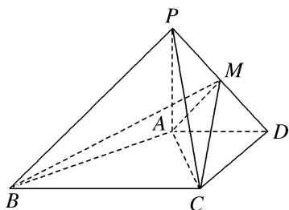
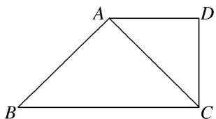
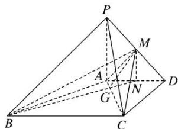
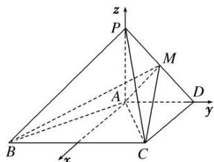

> [!faq]- 《专题14 利用空间向量解决立体几何中的探索性问题-立体几何（理科）》例题解析
>
> > [!success]- **【答案】** 详见解析
>
> > [!note]- **【分析】**
> > 本题未单列分析。
>
> > [!note]- **【解析】**
> > (1)求证： $AB\bot PC$
> > (2)在线段 $PD$ 上, 是否存在一点 $M$ , 使得二面角 $M - AC - D$ 的大小为 $45^{\circ}$ , 如果存在, 求 $BM$ 与平面 $MAC$ 所成角的正弦值, 如果不存在, 请说明理由.
> > 
> > 9. 解析
> > (1)如图，由已知得四边形 ABCD 是直角梯形，由 $AD = CD = 2\sqrt{2}$ ， $BC = 4\sqrt{2}$ ，可得 $\triangle ABC$ 是等腰直角三角形，即 $AB \perp AC$ ，因为 $PA \perp$ 平面 ABCD，所以 $PA \perp AB$ ，又 $PA \cap AC = A$ ，所以 $AB \perp$ 平面 PAC，所以 $AB \perp PC$ .
> > 
> > (2)法一(几何法): 过点 M 作 $MN \perp AD$ 交 AD 于点 N, 则 $MN \parallel PA$ , 因为 $PA \perp$ 平面 ABCD,
> > 
> > 所以 $MN \perp$ 平面 ABCD. 过点 M 作 $MG \perp AC$ 交 AC 于点 G, 连接 NG,
> > 则 $\angle MGN$ 是二面角 $M - AC - D$ 的平面角．若 $\angle MGN = 45^{\circ}$ ，则 $NG = MN$
> > 又 $AN = \sqrt{2} NG = \sqrt{2} MN$ ，所以 $MN = 1$ ，所以 $MN$ 納 $\frac{1}{2} PA$ ，所以 $M$ 是 $PD$ 的中点.
> > 在三棱锥 M-ABC 中，可得 $V_{M-ABC}=\frac{1}{3}S_{\triangle ABC}\cdot MN$ ,
> > 设点 B 到平面 MAC 的距离是 h，则 $V_{B-MAC}=\frac{1}{3}S_{\triangle MAC}\cdot h$ ，所以 $S_{\triangle ABC}\cdot MN=S_{\triangle MAC}\cdot h$ ，解得 $h=2\sqrt{2}$ .
> > 在 Rt△BMN 中，可得 $BM=3\sqrt{3}$ 。设 BM 与平面 MAC 所成的角为 $\theta$ ，则 $\sin\theta=\frac{h}{BM}=\frac{2\sqrt{6}}{9}$
> > 法二(向量法): 建立如图所示的空间直角坐标系, 则 $A(0, 0, 0)$ , $C(2\sqrt{2}, 2\sqrt{2}, 0)$ , $D(0, 2\sqrt{2}, 0)$ ,
> > $P(0, 0, 2), B(2\sqrt{2}, -2\sqrt{2}, 0), \overrightarrow{PD} = (0, 2\sqrt{2}, -2), \overrightarrow{AC} = (2\sqrt{2}, 2\sqrt{2}, 0).$
> > 
> > 设 $\overrightarrow{PM}=t\overrightarrow{PD}(0<t<1)$ ，则点M的坐标为 $(0,2\sqrt{2}t,2-2t)$ ，所以 $\overrightarrow{AM}=(0,2\sqrt{2}t,2-2t)$ .
> > 设平面 $MAC$ 的法向量是 $\pmb {n} = (x,y,z)$ ，则 $\left\{ \begin{array}{l}\mathrm{n}\cdot \overrightarrow{AC} = 0,\\ n\cdot \overrightarrow{AM} = 0, \end{array} \right.$ 得 $\left\{ \begin{array}{ll}2\sqrt{2} x + 2\sqrt{2} y = 0,\\ 2\sqrt{2} ty + 2 - 2t\quad z = 0, \end{array} \right.$
> > 则可取 $n = \left(1, -1, \frac{\sqrt{2}t}{1 - t}\right)$ . 又 $m = (0, 0, 1)$ 是平面 $ACD$ 的一个法向量，
> > 所以 $|\cos < m, n > | = \frac{|m \cdot n|}{|m||n|} = \frac{\left|\frac{\sqrt{2}t}{t - 1}\right|}{\sqrt{2 + \left(\frac{\sqrt{2}t}{t - 1}\right)^2}} = \cos 45^\circ = \frac{\sqrt{2}}{2}$ ，解得 $t = \frac{1}{2}$
> > 即点 M 是线段 PD 的中点．此时平面 MAC 的一个法向量可取 $\boldsymbol{n}_{0}=(1,-1,\sqrt{2})$ ,
> > $\overrightarrow{BM} = (-2\sqrt{2}, 3\sqrt{2}, 1)$ . 设 $BM$ 与平面 $MAC$ 所成的角为 $\theta$ , 则 $\sin \theta = |\cos < n_0, \overrightarrow{BM} >| = \frac{2\sqrt{6}}{9}$ .
