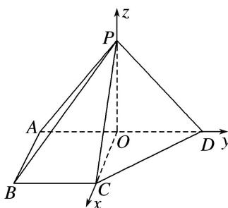

> [!faq]- 《专题14 利用空间向量解决立体几何中的探索性问题-立体几何（理科）》例题解析
>
> > [!success]- **【答案】** 详见解析
>
> > [!note]- **【解析】**
> > 解析
> > (1) 在 $\triangle PAD$ 中, $PA = PD$ , $O$ 为 $AD$ 的中点, $\therefore PO \perp AD$ .
> >
> > 又∵侧面 PAD⊥底面 ABCD，平面 PAD∩平面 ABCD=AD，PO⊂平面 PAD，∴PO⊥平面 ABCD. 在△PAD 中，PA⊥PD，PA=PD= $\sqrt{2}$ ，∴AD=2.
> >
> > 在直角梯形 ABCD 中，O 为 AD 的中点，∴OA=BC=1，∴OC⊥AD.
> >
> > 
> >
> > 以 O 为坐标原点，OC 所在直线为 x 轴，OD 所在直线为 y 轴，OP 所在直线为 z 轴建立空间直角坐标系，如图所示，则 $P(0, 0, 1)$ ， $A(0, -1, 0)$ ， $B(1, -1, 0)$ ， $C(1, 0, 0)$ ， $D(0, 1, 0)$ ，
> >
> > $$
> > \therefore \overrightarrow {P B} = (1, - 1, - 1). \because O A \perp O P, O A \perp O C, O P \cap O C = O, \therefore O A \perp
> > $$
> >
> > $\therefore \overrightarrow{OA} = (0, -1, 0)$ 为平面 $POC$ 的法向量， $\cos < \overrightarrow{PB}, \overrightarrow{OA} > = \frac{\overrightarrow{PB} \cdot \overrightarrow{OA}}{|\overrightarrow{PB}| |\overrightarrow{OA}|} = \frac{\sqrt{3}}{3}$ ,
> >
> > ∴PB 与平面 POC 所成角的余弦值为 $\frac{\sqrt{6}}{3}$ .
> >
> > (2) $\because\overrightarrow{PB}=(1,-1,-1)$ ，设平面PCD的法向量为 $u=(x,y,z)$ ，则 $\left\{\begin{aligned}&u\cdot\overrightarrow{CP}=-x+z=0,\\ &u\cdot\overrightarrow{PD}=y-z=0.\end{aligned}\right.$
> >
> > 取 z=1，得 $\boldsymbol{u}=(1,1,1)$ 。则 B 点到平面 PCD 的距离 $d=\frac{|\overrightarrow{PB}\cdot\boldsymbol{u}|}{|\boldsymbol{u}|}=\frac{\sqrt{3}}{3}$ .
> >
> > (3)假设存在，且设 $\overrightarrow{PQ}=\lambda\overrightarrow{PD}(0\leq\lambda\leq1)$ .
> >
> > $$
> > \because \overrightarrow {P D} = (0, 1, - 1), \therefore \overrightarrow {O Q} - \overrightarrow {O P} = \overrightarrow {P Q} = (0, \lambda , - \lambda), \therefore \overrightarrow {O Q} = (0, \lambda , 1 - \lambda), \therefore Q (0, \lambda , 1 - \lambda).
> > $$
> >
> > 设平面 CAQ 的法向量为 $\boldsymbol{m}=(x_{1},y_{1},z_{1})$ ，则 $\left\{\begin{aligned}\boldsymbol{m}\cdot\overrightarrow{AC}&=x_{1}+y_{1}=0,\\ \boldsymbol{m}\cdot\overrightarrow{AQ}&=\lambda+1\quad y_{1}+\quad1-\lambda\quad z_{1}=0.\end{aligned}\right.$
> >
> > 取 $z_{1}=1+\lambda$ ，得 $m=(1-\lambda,\lambda-1,\lambda+1)$ 。平面 CAD 的一个法向量为 $n=(0,0,1)$ ,
> >
> > ∵二面角 Q-AC-D 的余弦值为 $\frac{\sqrt{6}}{3}$ ,
> >
> > $$
> > \therefore | \cos <   m, n > | = \frac {| m \cdot n |}{| m | | n |} = \frac {| \lambda + 1 |}{\sqrt {(1 - \lambda) ^ {2} + (\lambda - 1) ^ {2} + (\lambda + 1) ^ {2}} \times 1} = \frac {\sqrt {6}}{3},
> > $$
> >
> > 整理化简，得 $3\lambda^2 - 10\lambda + 3 = 0$ 。解得 $\lambda = \frac{1}{3}$ 或 $\lambda = 3$ (舍去)，
> >
> > ∴线段 PD 上存在满足题意的点 Q，且 $\frac{PQ}{QD} = \frac{1}{2}$ .
