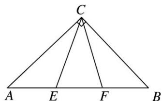

> [!faq]- 《专题1 三角形中基本量的计算问题-解三角形》例题解析
>
> > [!success]- **【答案】** 详见解析
>
> > [!note]- **【解析】**
> > 答案 $\frac{3}{4}$ 解析 如图，设 $AB = 6$ ，则 $AE = EF = FB = 2$ 。因为 $\triangle ABC$ 为等腰直角三角形，所以 $AC = BC = 3\sqrt{2}$ 。在 $\triangle ACE$ 中， $A = 45^{\circ}$ ， $AE = 2$ ， $AC = 3\sqrt{2}$ ，由余弦定理可得 $CE = \sqrt{10}$ 。同理，在 $\triangle BCF$ 中可得 $CF = \sqrt{10}$ 。在 $\triangle CEF$ 中，由余弦定理得 $\cos \angle ECF = \frac{10 + 10 - 4}{2 \times \sqrt{10} \times \sqrt{10}} = \frac{4}{5}$ ，所以 $\tan \angle ECF = \frac{3}{4}$ 。
> >
> > 
