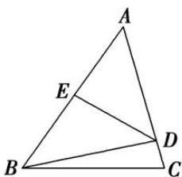

<!-- question-source:start -->
6. 如图，在 $\triangle ABC$ 中， $\angle C = \frac{\pi}{3}$ ， $BC = 4$ ，点 $D$ 在边 $AC$ 上， $AD = DB$ ， $DE \perp AB$ ， $E$ 为垂足。若 $DE = 2\sqrt{2}$ ，则 $\cos A$ 等于（）

A. $\frac{2\sqrt{2}}{3}$ B. $\frac{\sqrt{2}}{4}$ C. $\frac{\sqrt{6}}{4}$ D. $\frac{\sqrt{6}}{3}$
<!-- question-source:end -->

![[高中/总复习/专题/解三角形/专题1 三角形中基本量的计算问题-解三角形/考点01_计算三角形中的角或角的三角函数值/对点训练/answers/Q00039152A1.md]]
