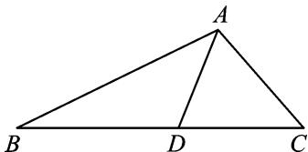

<!-- question-source:start -->
11. 如图, 在 $\triangle ABC$ 中, $AB=3$ , $AC=2$ , $BC=4$ , 点 $D$ 在边 $BC$ 上, $\angle BAD=45^{\circ}$ , 则 $\tan \angle CAD$ 的值为 \_\_\_\_.

<!-- question-source:end -->

![[高中/总复习/专题/解三角形/专题1 三角形中基本量的计算问题-解三角形/考点01_计算三角形中的角或角的三角函数值/对点训练/answers/Q00039157A1.md]]
