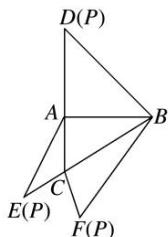

<!-- question-source:start -->
15. (2020·全国 I) 如图，在三棱锥 $P-ABC$ 的平面展开图中， $AC=1$ ， $AB=AD=\sqrt{3}$ ， $AB \perp AC$ ， $AB \perp AD$ ， $\angle CAE=30^{\circ}$ ，则 $\cos \angle FCB=$ \_\_\_\_.

<!-- question-source:end -->

![[高中/总复习/专题/解三角形/专题1 三角形中基本量的计算问题-解三角形/考点01_计算三角形中的角或角的三角函数值/对点训练/answers/Q00039161A1.md]]
