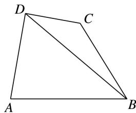
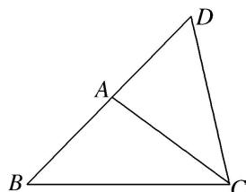

> [!faq]- 《专题1 三角形中基本量的计算问题-解三角形》例题解析
>
> > [!success]- **【答案】** C
>
> > [!note]- **【分析】**
> > 本题未单列分析。
>
> > [!note]- **【解析】**
> > 答案 4 解析 $\frac{a}{\sin A} = \frac{b}{\sin B} = \frac{c}{\sin C} = \frac{2\sqrt{3}}{\sin 60^\circ} = 4$ ，所以 $a = 4\sin A, b = 4\sin B, c = 4\sin C$ ，所以 $\frac{a + b + c}{\sin A + \sin B + \sin C} = \frac{4(\sin A + \sin B + \sin C)}{\sin A + \sin B + \sin C} = 4.$
> > (2)(2016·全国Ⅱ)△ABC 的内角 A, B, C 的对边分别为 a, b, c，若 $\cos A=\frac{4}{5}$ ， $\cos C=\frac{5}{13}$ ，a=1，则 b= \_\_\_\_.
> > 答案 $\frac{21}{13}$ 解析 因为 $A, C$ 为 $\triangle ABC$ 的内角，且 $\cos A = \frac{4}{5}, \cos C = \frac{5}{13}$ ，所以 $\sin A = \frac{3}{5}, \sin C = \frac{12}{13}$ ，所以 $\sin B = \sin (\pi - A - C) = \sin (A + C) = \sin A\cos C + \cos A\sin C = \frac{3}{5} \times \frac{5}{13} + \frac{4}{5} \times \frac{12}{13} = \frac{63}{65}$ . 又 $a = 1$ ，所以由正弦定理得 $b = \frac{a\sin B}{\sin A} = \frac{63}{65} \times \frac{5}{3} = \frac{21}{13}$ .
> > (3)在 $\triangle ABC$ 中， $C=\frac{2\pi}{3}$ ， $AB=3$ ，则 $\triangle ABC$ 的周长为（ ）A. $6\sin\left(A+\frac{\pi}{3}\right)+3$ B. $6\sin\left(A+\frac{\pi}{6}\right)+3$ C. $2\sqrt{3}\sin\left(A+\frac{\pi}{3}\right)+3$ D. $2\sqrt{3}\sin\left(A+\frac{\pi}{6}\right)+3$
> > 答案 C 解析 设 $\triangle ABC$ 的外接圆半径为 $R$ ，则 $2R = \frac{3}{\sin\frac{2\pi}{3}} = 2\sqrt{3}$ ，于是 $BC = 2R\sin A = 2\sqrt{3}\sin A$ ， $AC = 2R\sin B = 2\sqrt{3}\sin \left(\frac{\pi}{3} - A\right)$ 。于是 $\triangle ABC$ 的周长为 $2\sqrt{3}\left[\sin A + \sin \left(\frac{\pi}{3} - A\right)\right] + 3 = 2\sqrt{3}\sin \left(A + \frac{\pi}{3}\right) + 3$ 。
> > (4)(2016·全国Ⅰ)△ABC的内角A，B，C的对边分别为a，b，c．已知 $a=\sqrt{5}$ ，c=2， $\cos A=\frac{2}{3}$ ，则b=( )
> > A. $\sqrt{2}$ B. $\sqrt{3}$ C. 2
> > D. 3
> > 答案 D 解析 由余弦定理，得 $5=b^{2}+2^{2}-2\times b\times2\times\frac{2}{3}$ ，解得 $b=3\left(b=-\frac{1}{3}\text{舍去}\right)$ .
> > (5)(2018·全国Ⅱ)在△ABC中， $\cos\frac{C}{2}=\frac{\sqrt{5}}{5}$ ，BC=1，AC=5，则AB=( )
> > A. $4\sqrt{2}$ B. $\sqrt{30}$ C. $\sqrt{29}$ D. $2\sqrt{5}$
> > 答案 A 解析 由题意得 $\cos C = 2\cos^2\frac{C}{2} - 1 = 2 \times \left(\frac{\sqrt{5}}{5}\right)^2 - 1 = -\frac{3}{5}$ . 在 $\triangle ABC$ 中，由余弦定理得 $AB^2 = AC^2 + BC^2 - 2AC \times BC \times \cos C = 5^2 + 1^2 - 2 \times 5 \times 1 \times \left(-\frac{3}{5}\right) = 32$ ，所以 $AB = 4\sqrt{2}$ .
> > (6) $\triangle ABC$ 的内角 $A, B, C$ 所对的边分别为 $a, b, c$ , 且 $a, b, c$ 成等比数列. 若 $\sin B = \frac{5}{13}, \cos B = \frac{12}{ac}$ , 则 $a + c$ 的值为 \_\_\_\_.
> > 答案 $3\sqrt{7}$ 解析 因为 a, b, c 成等比数列，所以 $b^{2}=ac$ 。因为 $\sin B=\frac{5}{13}$ ， $\cos B=\frac{12}{ac}$ ，所以 ac=13，因为 $b^{2}=a^{2}+c^{2}-2ac\cos B$ ，所以 $a^{2}+c^{2}=37$ ，所以 $(a+c)^{2}=63$ ，所以 $a+c=3\sqrt{7}$ 。
> > (7)如图，在 $\triangle ABC$ 中， $\angle B=45^{\circ}$ ， $D$ 是 $BC$ 边上的一点， $AD=5$ ， $AC=7$ ， $DC=3$ ，则 $AB$ 的长为\_\_\_\_。
> > 
> > 答案 $\frac{5\sqrt{6}}{2}$ 解析 在 $\triangle ADC$ 中，AD=5, AC=7, DC=3，由余弦定理得 $\cos\angle ADC=\frac{AD^{2}+DC^{2}-AC^{2}}{2AD\cdot DC}=-\frac{1}{2},\therefore\angle ADC=120^{\circ},\angle ADB=60^{\circ}$ ，在 $\triangle ABD$ 中，AD=5, $\angle B=45^{\circ},\angle ADB=60^{\circ}$ ，由正弦定理得 $\frac{AB}{\sin\angle ADB}$
> > $$
> > = \frac {A D}{\sin B}, \therefore A B = \frac {5 \sqrt {6}}{2}.
> > $$
> > (8)如图所示, 在四边形 $ABCD$ 中, $AD \perp CD$ , $AD = 10$ , $AB = 14$ , $\angle BDA = 60^{\circ}$ , $\angle BCD = 135^{\circ}$ , 则 $BC$ 的长为 \_\_\_\_.
> > 
> > 答案 $8\sqrt{2}$ 解析 在 $\triangle ABD$ 中，由余弦定理，得 $AB^{2} = AD^{2} + BD^{2} - 2AD\cdot BD\cdot \cos \angle ADB$ ，设 $BD = x$ 则有 $14^{2} = 10^{2} + x^{2} - 2\times 10x\cos 60^{\circ}$ ， $\therefore x^{2} - 10x - 96 = 0$ ， $\therefore x_{1} = 16$ ， $x_{2} = -6$ （舍去）， $\therefore BD = 16$ 。在 $\triangle BCD$ 中，由正弦定理知， $\frac{BC}{\sin\angle CDB} = \frac{BD}{\sin\angle BCD}$ ， $\therefore BC = \frac{16}{\sin 135^\circ}\cdot \sin 30^\circ = 8\sqrt{2}$
> > (9)在 $\triangle ABC$ 中，三个内角 $A, B, C$ 所对的边分别为 $a, b, c$ ，若 $S_{\triangle ABC}=2\sqrt{3}, a+b=6, \frac{a\cos B+b\cos A}{c}$ =2 $\cos C$ ，则 $c$ 等于（）A. $2\sqrt{7}$ B. 4 C. $2\sqrt{3}$ D. $3\sqrt{3}$
> > 答案 C 解析 $\because \frac{a\cos B + b\cos A}{c} = 2\cos C$ ，由正弦定理，得 $\sin A\cos B + \cos A\sin B = 2\sin C\cos C, \therefore \sin(A + B) = \sin C = 2\sin C\cos C$ ，由于 $0 < C < \pi, \sin C \neq 0, \therefore \cos C = \frac{1}{2}, \therefore C = \frac{\pi}{3}, \because S_{\triangle ABC} = 2\sqrt{3} = \frac{1}{2}ab\sin C = \frac{\sqrt{3}}{4}ab, \therefore ab = 8$ ，又 $a + b = 6$ ，解得 $\left\{\begin{aligned}a &= 2, \\ b &= 4\end{aligned}\right.$ 或 $\left\{\begin{aligned}a &= 4, \\ b &= 2,\end{aligned}\right.$ $c^{2} = a^{2} + b^{2} - 2ab\cos C = 4 + 16 - 8 = 12, \therefore c = 2\sqrt{3}$ ，故选 C.
> > (10)已知 $\triangle ABC$ 中， $AC=\sqrt{2}$ ， $BC=\sqrt{6}$ ， $\triangle ABC$ 的面积为 $\frac{\sqrt{3}}{2}$ 。若线段 $BA$ 的延长线上存在点 $D$ ，使 $\angle BDC=\frac{\pi}{4}$ ，则 $CD=$ \_\_\_\_。
> > 答案 $\sqrt{3}$ 解析 因为 $S_{\triangle ABC} = \frac{1}{2} AC \cdot BC \cdot \sin \angle BCA$ ，即 $\frac{\sqrt{3}}{2} = \frac{1}{2} \times \sqrt{2} \times \sqrt{6} \times \sin \angle BCA$ ，所以 $\sin \angle BCA = \frac{1}{2}$ . 因为 $\angle BAC > \angle BDC = \frac{\pi}{4}$ ，所以 $\angle DAC < \frac{3\pi}{4}$ ，又 $\angle DAC = \angle ABC + \angle ACB$ ，所以 $\angle ACB < \frac{3\pi}{4}$ ，则 $\angle BCA = \frac{\pi}{6}$ ，所以 $\cos \angle BCA = \frac{\sqrt{3}}{2}$ . 在 $\triangle ABC$ 中， $AB^2 = AC^2 + BC^2 - 2AC \cdot BC \cdot \cos \angle BCA = 2 + 6 - 2 \times \sqrt{2} \times \sqrt{6} \times \frac{\sqrt{3}}{2} = 2$ ，所以 $AB = \sqrt{2} = AC$ ，所以 $\angle ABC = \angle ACB = \frac{\pi}{6}$ ，在 $\triangle BCD$ 中， $\frac{BC}{\sin \angle BDC} = \frac{CD}{\sin \angle DBC}$ ，即 $\frac{\sqrt{6}}{\frac{\sqrt{2}}{2}} = \frac{CD}{\frac{1}{2}}$ ，解得 $CD = \sqrt{3}$ .
> > 
> > 【对点训练】
