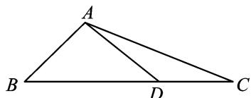

<!-- question-source:start -->
25. 如图, 在 $\triangle ABC$ 中, $D$ 是 $BC$ 上的一点. 已知 $\angle B = 60^{\circ}$ , $AD = 2$ , $AC = \sqrt{10}$ , $DC = \sqrt{2}$ , 则 $AB =$ \_\_\_\_.

<!-- question-source:end -->

![[高中/总复习/专题/解三角形/专题1 三角形中基本量的计算问题-解三角形/考点02_计算三角形中的边或周长/对点训练/answers/Q00039199A1.md]]
