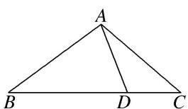

<!-- question-source:start -->
26. 如图，在 $\triangle ABC$ 中， $AB = \sqrt{2}$ ，点 $D$ 在边 $BC$ 上， $BD = 2DC$ ， $\cos \angle DAC = \frac{3\sqrt{10}}{10}$ ， $\cos \angle C = \frac{2\sqrt{5}}{5}$ ，则 $AC =$ \_\_\_\_.

<!-- question-source:end -->

![[高中/总复习/专题/解三角形/专题1 三角形中基本量的计算问题-解三角形/考点02_计算三角形中的边或周长/对点训练/answers/Q00039200A1.md]]
