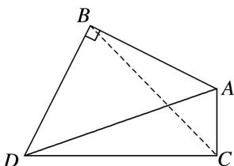

> [!faq]- 《专题1 三角形中基本量的计算问题-解三角形》例题解析
>
> > [!success]- **【答案】** 详见解析
>
> > [!note]- **【分析】**
> > 本题未单列分析。
>
> > [!note]- **【解析】**
> > 答案 $\frac{4\sqrt{3}}{3}$ 解析 如图，连接 $BC, BC = \sqrt{2^2 + 1^2 - 2 \times 2 \times 1 \times \cos 120^\circ} = \sqrt{7}$ ，在 $\triangle ABC$ ，由正弦定理知， $\frac{2}{\sin \angle ACB} = \frac{\sqrt{7}}{\sin 120^\circ}, \therefore \sin \angle ACB = \frac{\sqrt{21}}{7}$ . 又 $\because \angle ACD = 90^\circ, \therefore \cos \angle BCD = \frac{\sqrt{21}}{7}, \sin \angle BCD = \frac{2\sqrt{7}}{7}$ ，由 $AB \perp BD, AC \perp CD, \angle BAC = 120^\circ$ ，得 $\angle BDC = 60^\circ$ . 由正弦定理，得 $BD = \frac{BC \cdot \sin \angle BCD}{\sin 60^\circ} = \frac{\sqrt{7} \times \frac{2\sqrt{7}}{7}}{\frac{\sqrt{3}}{2}} = \frac{4\sqrt{3}}{3}$ .
> >
> > 
