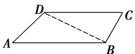

> [!faq]- 《专题1 三角形中基本量的计算问题-解三角形》例题解析
>
> > [!success]- **【答案】** 详见解析
>
> > [!note]- **【解析】**
> > 答案 $\frac{3\sqrt{2}}{2} a$ 解析 如图所示, 连接 $BD$ . $\because A + \angle ABC + C + \angle ADC = 360^\circ$ , $\therefore A = 45^\circ$ , $\angle ABC = 105^\circ$ , $C = 60^\circ$ , $\angle ADC = 150^\circ$ , 在 $\triangle BCD$ 中, 由余弦定理, 得 $BD^2 = BC^2 + CD^2 - 2BC \cdot CD \cos C = a^2 + 4a^2 - 2a \cdot 2a \cdot \cos 60^\circ = 3a^2$ , $\therefore BD = \sqrt{3} A$ . $\therefore BD^2 + BC^2 = CD^2$ , $\therefore \angle CBD = 90^\circ$ , $\therefore \angle ABD = 15^\circ$ , $\therefore \angle BDA = 120^\circ$ . 在 $\triangle ABD$ 中, 由 $\frac{AB}{\sin \angle BDA} = \frac{BD}{\sin A}$ , 得 $AB = \frac{BD \cdot \sin \angle BDA}{\sin A} = \frac{\sqrt{3} a \sin 120^\circ}{\sin 45^\circ} = \frac{3\sqrt{2}}{2} a$ .
> >
> > 
