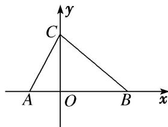

<!-- question-source:start -->
5. 如图，在 $\triangle ABC$ 中，三个内角 $B, A, C$ 成等差数列，且 $AC = 10, BC = 15$ .

(1)求 $\triangle ABC$ 的面积;

(2)已知平面直角坐标系 $xOy$ 中点 $D(10, 0)$ ，若函数 $f(x) = M\sin (\omega x + \varphi)M > 0$ ， $\omega > 0$ ， $|\varphi| < \frac{\pi}{2}$ 的图象经过 $A$ ， $C$ ， $D$ 三点，且 $A$ ， $D$ 为 $f(x)$ 的图象与 $x$ 轴相邻的两个交点，求 $f(x)$ 的解析式.

<!-- question-source:end -->

![[高中/总复习/专题/解三角形/专题10 解三角形综合问题-解三角形/考点01_正_余弦定理与三角函数结合的问题/对点训练/answers/Q00044820A1.md]]
