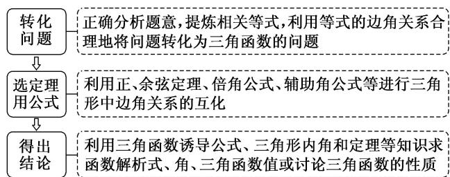

## 考点一 正、余弦定理与三角函数结合的问题

【方法总结】

解三角形与三角函数交汇问题一般步骤

## 【例题选讲】

![[高中/总复习/专题/解三角形/专题10 解三角形综合问题-解三角形/考点01_正_余弦定理与三角函数结合的问题/例题/Q00044811.md]]
![[高中/总复习/专题/解三角形/专题10 解三角形综合问题-解三角形/考点01_正_余弦定理与三角函数结合的问题/例题/Q00044812.md]]
![[高中/总复习/专题/解三角形/专题10 解三角形综合问题-解三角形/考点01_正_余弦定理与三角函数结合的问题/例题/Q00044813.md]]
![[高中/总复习/专题/解三角形/专题10 解三角形综合问题-解三角形/考点01_正_余弦定理与三角函数结合的问题/例题/Q00044814.md]]
![[高中/总复习/专题/解三角形/专题10 解三角形综合问题-解三角形/考点01_正_余弦定理与三角函数结合的问题/例题/Q00044815.md]]
![[高中/总复习/专题/解三角形/专题10 解三角形综合问题-解三角形/考点01_正_余弦定理与三角函数结合的问题/例题/Q00039214.md]]
![[高中/总复习/专题/解三角形/专题10 解三角形综合问题-解三角形/考点01_正_余弦定理与三角函数结合的问题/对点训练/Q00044816.md]]
![[高中/总复习/专题/解三角形/专题10 解三角形综合问题-解三角形/考点01_正_余弦定理与三角函数结合的问题/对点训练/Q00044817.md]]
![[高中/总复习/专题/解三角形/专题10 解三角形综合问题-解三角形/考点01_正_余弦定理与三角函数结合的问题/对点训练/Q00044818.md]]
![[高中/总复习/专题/解三角形/专题10 解三角形综合问题-解三角形/考点01_正_余弦定理与三角函数结合的问题/对点训练/Q00044819.md]]
![[高中/总复习/专题/解三角形/专题10 解三角形综合问题-解三角形/考点01_正_余弦定理与三角函数结合的问题/对点训练/Q00044820.md]]
![[高中/总复习/专题/解三角形/专题10 解三角形综合问题-解三角形/考点01_正_余弦定理与三角函数结合的问题/对点训练/Q00044821.md]]
![[高中/总复习/专题/解三角形/专题10 解三角形综合问题-解三角形/考点01_正_余弦定理与三角函数结合的问题/对点训练/Q00044822.md]]
![[高中/总复习/专题/解三角形/专题10 解三角形综合问题-解三角形/考点01_正_余弦定理与三角函数结合的问题/对点训练/Q00044823.md]]
![[高中/总复习/专题/解三角形/专题10 解三角形综合问题-解三角形/考点01_正_余弦定理与三角函数结合的问题/对点训练/Q00044824.md]]
