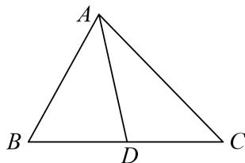
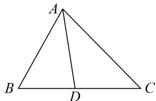
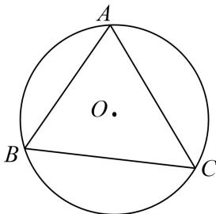
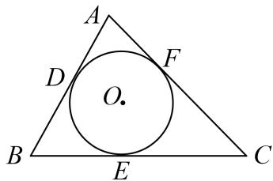

<!-- source-part:1 pages:1-14 -->

## 专题二 三角形的三线两圆及面积问题

## 一．中线

中线定理：一条中线两侧所对边的平方和等于底边平方的一半与该边中线平方的2倍.即：如图，在 $\Delta ABC$ 中， $D$ 为 $BC$ 中点，则 $AB^{2} + AC^{2} = \frac{1}{2} BC^{2} + 2AD^{2}$

证明 在 $\Delta ABD$ 中， $\cos B = \frac{AB^2 + BD^2 - AD^2}{2AB \cdot BD}$ ，在 $\Delta ABC$ 中， $\cos B = \frac{AB^2 + BC^2 - AC^2}{2AB \cdot BC}$ 。 $\therefore AB^2 + AC^2 = \frac{1}{2} BC^2 + 2AD^2$ 。

另外已知两边及其夹角也可表述为： $4AD^{2}=AB^{2}+AC^{2}+2AB\cdot AC\cdot\cos A$

证明 由 $\overrightarrow{AD} = \frac{1}{2} (\overrightarrow{AB} +\overrightarrow{AC})$ ， $\Rightarrow \overrightarrow{AD}^2 = \frac{1}{4} (\overrightarrow{AB} +\overrightarrow{AC})^2 = \frac{1}{4}\overrightarrow{AB}^2 +\frac{1}{4}\overrightarrow{AC}^2 +\frac{1}{2}\left|\overrightarrow{AB}\right|\left|\overrightarrow{AC}\right|\cos A$ ， $\therefore 4AD^{2} = AB^{2} + AC^{2} + 2AB\cdot AC\cdot \cos A.$

## 二．角平分线

角平分线定理：如图，在 $\Delta ABC$ 中， $AD$ 是 $\angle BAC$ 的平分线，则 $\frac{AB}{AC} = \frac{BD}{CD}$

证法1 在 $\Delta ABD$ 中， $\frac{AB}{\sin \angle ADB} = \frac{BD}{\sin \angle BAD}$ ，在 $\Delta ACD$ 中， $\frac{AC}{\sin \angle ADC} = \frac{CD}{\sin \angle CAD}$ ， $\therefore \frac{AB}{AC} = \frac{BD}{CD}$ 。证法2 该结论可以由两三角形面积之比得证，即 $\frac{S_{\Delta ABD}}{S_{\Delta ACD}} = \frac{AB}{AC} = \frac{BD}{CD}$ 。

## 三．高

高的性质： $h_{1}$ ， $h_{2}$ ， $h_{3}$ 分别为 $\Delta ABC$ 边 a，b，c 上的高，则 $h_{1}:h_{2}:h_{3}=\frac{1}{a}:\frac{1}{b}:\frac{1}{c}=\frac{1}{\sin A}:\frac{1}{\sin B}:\frac{1}{\sin C}$ 求高一般采用等面积法，即求某边上的高，需要求出面积和底边长度.

## 四．外接圆

过三角形三个顶点的圆叫三角形的外接圆．其圆心叫做三角形的外心.

外接圆半径的计算： $R=\frac{a}{2\sin A}=\frac{b}{2\sin B}=\frac{c}{2\sin C}$ .

外接圆半径与三角形面积的关系： $S_{\triangle ABC}=\frac{abc}{4R}=(R \text{ 为 } \triangle ABC \text{ 外接圆半径}).$

## 五．内切圆

与三角形三边都相切的圆叫三角形的内切圆．其圆心叫做三角形的内心.

内切圆半径与三角形面积的关系： $S_{\triangle ABC}=\frac{1}{2}(a+b+c)\cdot r$ (r 为 $\triangle ABC$ 内切圆半径)，并可由此计算 r.

![[高中/总复习/专题/解三角形/专题2 三角形的3线两圆及面积问题-解三角形/考点01_三角形的三线两圆问题/考点01_三角形的三线两圆问题.md]]
![[高中/总复习/专题/解三角形/专题2 三角形的3线两圆及面积问题-解三角形/考点02_计算三角形的面积/考点02_计算三角形的面积.md]]
