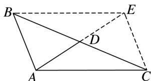

> [!faq]- 《专题2 三角形的3线两圆及面积问题-解三角形》例题解析
>
> > [!success]- **【答案】** 详见解析
>
> > [!note]- **【解析】**
> > 答案 9 解析 如图所示，延长 AD 到 E，使 DE=AD，连接 BE，EC。因为 AD 是 BC 边上的中线，所以 AE 与 BC 互相平分，所以四边形 ACEB 是平行四边形，所以 BE=AC=7。又 AB=4，AE=2AD=7，所以在 $\triangle ABE$ 中，由余弦定理得， $AE^{2}=49=AB^{2}+BE^{2}-2AB\cdot BE\cdot\cos\angle ABE=AB^{2}+AC^{2}-2AB\cdot AC\cdot\cos\angle ABE$ 。在 $\triangle ABC$ 中，由余弦定理得， $BC^{2}=AB^{2}+AC^{2}-2AB\cdot AC\cdot\cos(\pi-\angle ABE)$ ，∴ $49+BC^{2}=2(AB^{2}+AC^{2})=2(16+49)$ ，∴ $BC^{2}=81$ ，∴ BC=9。
> >
> > 
