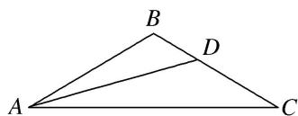

> [!faq]- 《专题2 三角形的3线两圆及面积问题-解三角形》例题解析
>
> > [!success]- **【答案】** 详见解析
>
> > [!note]- **【分析】**
> > 本题未单列分析。
>
> > [!note]- **【解析】**
> > 答案 $\sqrt{6}$ 解析 如图，在 $\triangle ABD$ 中，由正弦定理，得 $\frac{AD}{\sin B}=\frac{AB}{\sin\angle ADB},\quad\therefore\sin\angle ADB=\frac{\sqrt{2}}{2}.$
> > 
> > 由题意知 $0^{\circ} < \angle ADB < 60^{\circ}$ , $\therefore \angle ADB = 45^{\circ}$ , $\therefore \angle BAD = 180^{\circ} - 45^{\circ} - 120^{\circ} = 15^{\circ}$ . $\therefore \angle BAC = 30^{\circ}$ , $C = 30^{\circ}$ , $\therefore BC = AB = \sqrt{2}$ . 在 $\triangle ABC$ 中, 由正弦定理, 得 $\frac{AC}{\sin B} = \frac{BC}{\sin \angle BAC}$ , $\therefore AC = \sqrt{6}$ .
