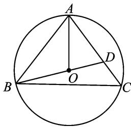
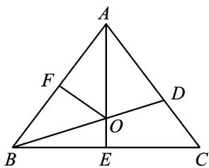
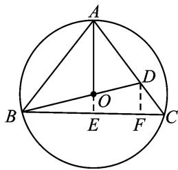

> [!faq]- 《专题2 三角形的3线两圆及面积问题-解三角形》例题解析
>
> > [!success]- **【答案】** 详见解析
>
> > [!note]- **【分析】**
> > 本题未单列分析。
>
> > [!note]- **【解析】**
> > 答案 $3\sqrt{6}$ 解析 解法1 如图1，设 $\triangle ABC$ 的外心为 $O$ ，连结 $AO$ ，则 $AO$ 是 $\angle BAC$ 的平分线，所以 $\frac{BO}{OD} = \frac{AB}{AD} = \frac{3}{2}$ ，所以 $\overrightarrow{AO} = \overrightarrow{AB} +\overrightarrow{BO} = \overrightarrow{AB} +\frac{3}{5}\overrightarrow{BD} = \overrightarrow{AB} +\frac{3}{5} (\overrightarrow{AD} -\overrightarrow{AB})$ ，即 $\overrightarrow{AO} = \frac{2}{5}\overrightarrow{AB} +\frac{3}{5}\overrightarrow{AD}$ ，两边同时点乘 $\overrightarrow{AB}$ 得 $\overrightarrow{AO}\cdot \overrightarrow{AB} = \frac{2}{5} (\overrightarrow{AB})^2 +\frac{3}{5}\overrightarrow{AB}\cdot \overrightarrow{AD}$ ，即 $18 = \frac{2}{5}\times 36 + \frac{3}{5}\times 6\times 4\cos \angle BAC$ ，所以 $\cos \angle BAC = \frac{1}{4}$ 则 $BC = \sqrt{36 + 36 - 2\times 6^2\times\frac{1}{4}}$ $= 3\sqrt{6}$ .（说明：两边同时点乘 $\overrightarrow{AD}$ 也是一样的）
> > 
> > 图 1
> > 
> > 图 2
> > 
> > 图 3
> > 解法2 如图2，设 $\angle BAC = 2\alpha$ ，外接圆的半径为 $R$ ，由 $S_{\triangle ABO} + S_{\triangle ADO} = S_{\triangle ABD}$ ，得 $\frac{1}{2}\cdot 6R\sin \alpha +\frac{1}{2}\cdot 4R\sin \alpha$ $= \frac{1}{2}\cdot 6\cdot 4\sin 2\alpha$ ，化简得 $24\cos \alpha = 5R$ 。在 Rt△AFO 中， $R\cos \alpha = 3$ ，联立解得 $R = \frac{6}{5}\sqrt{10},\cos \alpha = \sqrt{\frac{5}{8}}$ ，所以 $\sin \alpha$ $= \sqrt{\frac{3}{8}}$ ，所以 $BC = 2BE = 2AB\sin \alpha = 12\times \sqrt{\frac{3}{8}} = 3\sqrt{6}.$
> > 解法 3 如图 3，延长 AO 交 BC 于点 E，过点 D 作 BC 的垂线，垂足为 F，则 $\frac{BO}{OD} = \frac{AB}{AD} = \frac{3}{2}$ ， $\frac{OE}{DF} = \frac{BO}{BD} = \frac{3}{5}$ 。又 $DF \parallel AE$ ，则 $\frac{DF}{AE} = \frac{CD}{CA} = \frac{1}{3}$ ，所以 $\frac{OE}{AE} = \frac{1}{5}$ 。设 OE = x，则 AE = 5x，所以 OB = OA = 4x，所以 $BE = \sqrt{15}x$ 。又因为 $25x^{2} + 15x^{2} = 36$ ，所以 $x = 3\sqrt{\frac{1}{10}}$ ，所以 $BC = 2BE = 3\sqrt{6}$ 。
