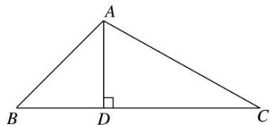

<!-- question-source:start -->
2. 如图所示, 在 $\triangle ABC$ 中, 已知 $BC = 15$ , $AB:AC = 7:8$ , $\sin B = \frac{4\sqrt{3}}{7}$ , 则 $BC$ 边上的高 $AD$ 的长为 \_\_\_\_.

<!-- question-source:end -->

![[高中/总复习/专题/解三角形/专题2 三角形的3线两圆及面积问题-解三角形/考点01_三角形的三线两圆问题/对点训练/answers/Q00039244A1.md]]
