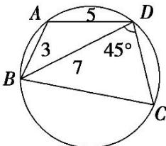

<!-- question-source:start -->
16. 如图所示, 已知圆内接四边形 $ABCD$ 中 $AB = 3$ , $AD = 5$ , $BD = 7$ , $\angle BDC = 45^\circ$ , 则 $BC =$ \_\_\_\_.

<!-- question-source:end -->

![[高中/总复习/专题/解三角形/专题2 三角形的3线两圆及面积问题-解三角形/考点01_三角形的三线两圆问题/对点训练/answers/Q00039258A1.md]]
