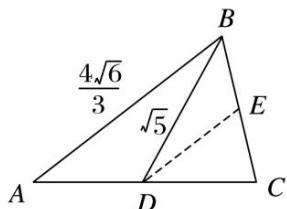

> [!faq]- 《专题2 三角形的3线两圆及面积问题-解三角形》例题解析
>
> > [!success]- **【答案】** 详见解析
>
> > [!note]- **【分析】**
> > 本题未单列分析。
>
> > [!note]- **【解析】**
> > 答案 $\frac{\sqrt{70}}{14}$ 解析 如图所示，取 BC 的中点 E，连接 DE，则 $DE \parallel AB$ ，且 $DE = \frac{1}{2} AB = \frac{2\sqrt{6}}{3}$ .
> > 
> > $\because \cos \angle ABC = \frac{\sqrt{6}}{6}, \therefore \cos \angle BED = -\frac{\sqrt{6}}{6}$ . 设 $BE = x$ ，在 $\triangle BDE$ 中，利用余弦定理，可得 $BD^2 = BE^2 + ED^2 - 2BE \cdot ED \cdot \cos \angle BED$ ，即 $5 = x^2 + \frac{8}{3} + 2 \times \frac{2\sqrt{6}}{3} \times \frac{\sqrt{6}}{6}x$ . 解得 $x = 1$ 或 $x = -\frac{7}{3}$ (舍去)，故 $BC = 2$ 。在 $\triangle ABC$ 中，利用余弦定理，可得 $AC^2 = AB^2 + BC^2 - 2AB \cdot BC \cdot \cos \angle ABC = \frac{28}{3}$ ，即 $AC = \frac{2\sqrt{21}}{3}$ . 又 $\sin \angle ABC =$
> > $$
> > \sqrt {1 - \cos^ {2} \angle A B C} = \frac {\sqrt {3 0}}{6}, \therefore \frac {2}{\sin A} = \frac {\frac {2 \sqrt {2 1}}{3}}{\frac {\sqrt {3 0}}{6}}, \therefore \sin A = \frac {\sqrt {7 0}}{1 4}.
> > $$
