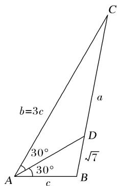

> [!faq]- 《专题2 三角形的3线两圆及面积问题-解三角形》例题解析
>
> > [!success]- **【答案】** B
>
> > [!note]- **【分析】**
> > 本题未单列分析。
>
> > [!note]- **【解析】**
> > 答案 B 解析 法一 如图, 因为 $\angle BAC = 60^{\circ}$ , $AD$ 为 $\angle BAC$ 的平分线, 所以 $\angle CAD = \angle BAD = 30^{\circ}$ . 又 $b = 3c$ ,
> >
> > 
> >
> > 所以 $\frac{CD}{BD} = \frac{S_{\triangle CAD}}{S_{\triangle DAB}} = \frac{\frac{1}{2}b\cdot AD\cdot \sin 30^\circ}{\frac{1}{2}AD\cdot c\sin 30^\circ} = \frac{b}{c} = 3$ 。因为 $BD = \sqrt{7}$ ，所以 $CD = 3\sqrt{7}$ ，所以 $a = CB = 4\sqrt{7}$ 。因为 $a^2 = b^2 + c^2 - 2bc\cos \angle CAB$ ，所以 $16\times 7 = 9c^2 + c^2 - 2\cdot 3c\cdot c\cdot \frac{1}{2}$ ，解得 $c = 4$ 。在 $\triangle ABD$ 中，由正弦定理，知 $\frac{BD}{\sin \angle BAD} = \frac{c}{\sin \angle ADB}$ ，即 $\frac{\sqrt{7}}{\frac{1}{2}} = \frac{4}{\sin \angle ADB}$ ，所以 $\sin \angle ADB = \frac{2}{\sqrt{7}}$ 。因为 $b = 3c > c$ ，所以 $B > C$ 。因为 $\angle ADB = 30^\circ + C$ ， $\angle ADC = 30^\circ + B$ ，所以 $\angle ADB < \angle ADC$ ，又 $\angle ADB + \angle ADC = 180^\circ$ ，所以 $\angle ADB$ 为锐角，所以 $\cos \angle ADB = \sqrt{1 - \sin^2\angle ADB} = \sqrt{1 - \frac{4}{7}} = \sqrt{\frac{3}{7}} = \frac{\sqrt{21}}{7}$ 。故选 B。
> >
> > 法二 因为 $\angle BAC = 60^\circ$ ， $AD$ 为 $\angle BAC$ 的平分线，所以 $\angle CAD = \angle BAD = 30^\circ$ 。又 $b = 3c$ ，所以 $\frac{CD}{BD} = \frac{S_{\triangle CAD}}{S_{\triangle DAB}} = \frac{\frac{1}{2}b\cdot AD\cdot \sin 30^\circ}{\frac{1}{2}AD\cdot c\sin 30^\circ} = \frac{b}{c} = 3$ 。因为 $BD = \sqrt{7}$ ，所以 $CD = 3 \sqrt{7}$ ，所以 $a = CB = 4\sqrt{7}$ 。因为 $a^2 = b^2 + c^2 - 2bc\cos \angle BAC$ ，所以 $16\times 7 = 9c^2 + c^2 - 2\cdot 3c\cdot c\cdot \frac{1}{2}$ ，解得 $c = 4$ 。由余弦定理，得 $\cos \angle BAD = \frac{AD^2 + c^2 - BD^2}{2AD\cdot c}$ ，即$\frac{\sqrt{3}}{2} = \frac{AD^2 + 16 - 7}{8AD}$ , 所以 $AD^2 - 4\sqrt{3} AD + 9 = 0$ , 所以 $(AD - \sqrt{3})(AD - 3\sqrt{3}) = 0$ . 所以 $AD = 3\sqrt{3}$ 或 $AD = \sqrt{3}$ . 因为 $b = 3c > c$ , 所以 $B > C$ . 又 $B + C = 120^\circ$ , 所以 $B > 60^\circ > \angle BAD$ , 所以 $AD > BD = \sqrt{7}$ , 所以 $AD = 3\sqrt{3}$ , 所以 $\cos \angle ADB = \frac{DA^2 + DB^2 - AB^2}{2DA \cdot DB} = \frac{27 + 7 - 16}{2 \times 3\sqrt{3} \times \sqrt{7}} = \frac{\sqrt{21}}{7}$ .
> >
> > 故选 **B**.
