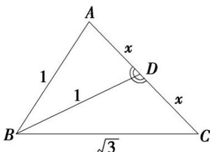

> [!faq]- 《专题2 三角形的3线两圆及面积问题-解三角形》例题解析
>
> > [!success]- **【答案】** 详见解析
>
> > [!note]- **【分析】**
> > 本题未单列分析。
>
> > [!note]- **【解析】**
> > 答案 1 解析 如图, $AB = 1$ , $BD = 1$ , $BC = \sqrt{3}$ , 设 $AD = DC = x$ , 在 $\triangle ABD$ 中, $\cos \angle ADB = \frac{x^2 + 1 - 1}{2x} = \frac{x}{2}$ , 在 $\triangle BDC$ 中, $\cos \angle BDC = \frac{x^2 + 1 - 3}{2x} = \frac{x^2 - 2}{2x}$ , $\because \angle ADB$ 与 $\angle BDC$ 互补, $\therefore \cos \angle ADB = -\cos \angle BDC$ , $\therefore \frac{x}{2} = -\frac{x^2 - 2}{2x}$ , $\therefore x = 1$ , $\therefore \angle A = 60^\circ$ , 由 $\frac{\sqrt{3}}{\sin 60^\circ} = 2R$ , 得 $R = 1$ .
> >
> > 
