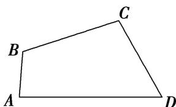

<!-- question-source:start -->
(8)已知四边形ABCD中， $AB = 2$ ， $BC = CD = 4$ ， $DA = 6$ ，且 $D = 60^{\circ}$ ，试求四边形ABCD的面积.

<!-- question-source:end -->

![[高中/总复习/专题/解三角形/专题2 三角形的3线两圆及面积问题-解三角形/考点02_计算三角形的面积/例题/answers/Q00044857A1.md]]
