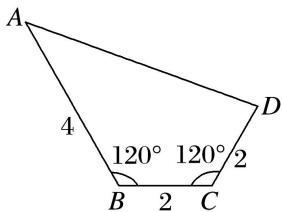

<!-- question-source:start -->
14. 如图, 在四边形 $ABCD$ 中, $B = C = 120^{\circ}$ , $AB = 4$ , $BC = CD = 2$ , 则该四边形的面积等于

<!-- question-source:end -->

![[高中/总复习/专题/解三角形/专题2 三角形的3线两圆及面积问题-解三角形/考点02_计算三角形的面积/对点训练/answers/Q00039275A1.md]]
