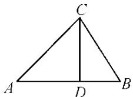

> [!faq]- 《专题4 三角形中的最值(范围)问题-解三角形》例题解析
>
> > [!success]- **【答案】** 详见解析
>
> > [!note]- **【分析】**
> > 本题未单列分析。
>
> > [!note]- **【解析】**
> > $$
> > \left(1, \frac {2 \sqrt {3}}{3}\right)
> > $$
> > 12. 答案 $\left[1, \frac{2\sqrt{3}}{3}\right]$ 解析 思路一，根据题意可知，本题可以从“解三角形和三角恒等变换”角度切入，又因已知锐角和边的关系，而所求为正切值，故把条件化为角的正弦和余弦来处理即可；思路二，本题所求为正切值，故可以构造直角三角形，用边的关系处理.
> > 解法 1 原式可化为 $\frac{1}{\tan A} - \frac{1}{\tan B} = \frac{\cos A}{\sin A} - \frac{\cos B}{\sin B} = \frac{\sin B \cos A - \cos B \sin A}{\sin A \sin B} = \frac{\sin (B - A)}{\sin A \sin B}$ . 由 $b^2 - a^2 = ac$ 得， $b^2 = a^2 + ac = a^2 + c^2 - 2ac \cos B$ ，即 $a = c - 2ac \cos B$ ，也就是 $\sin A = \sin C - 2\sin A \cos B$ ，即 $\sin A = \sin (A + B) - 2\sin A \cos B = \sin (B - A)$ ，由于 $\triangle ABC$ 为锐角三角形，所以有 $A = B - A$ ，即 $B = 2A$ ，故 $\frac{1}{\tan A} - \frac{1}{\tan B} = \frac{1}{\sin B}$ ，在锐角三角形 $ABC$ 中易知， $\frac{\pi}{3} < B < \frac{\pi}{2}$ ， $\frac{\sqrt{3}}{2} < \sin B < 1$ ，故 $\frac{1}{\tan A} - \frac{1}{\tan B} \in \left[1, \frac{2\sqrt{3}}{3}\right]$ .
> > 解法2 根据题意，作 $CD \perp AB$ ，垂足为点 $D$ ，画出示意图．因为 $b^{2} - a^{2} = AD^{2} - BD^{2} = (AD + BD)(AD - BD) = c(AD - BD) = ac$ ，所以 $AD - BD = a$ ，而 $AD + BD = c$ ，所以 $BD = \frac{c - a}{2}$ ，则 $c > a$ ，即 $\frac{c}{a} > 1$ ，在锐角三角形 $ABC$ 中有 $b^{2} + a^{2} > c^{2}$ ，则 $a^{2} + a^{2} + ac > c^{2}$ ，即 $\left(\frac{c}{a}\right)^{2} - \frac{c}{a} - 2 < 0$ ，解得 $-1 < \frac{c}{a} < 2$ ，因此， $1 < \frac{c}{a} < 2$ ．而 $\frac{1}{\tan A} - \frac{1}{\tan B} = \frac{AD - BD}{CD} = \frac{a}{\sqrt{a^2 - \left(\frac{c - a}{2}\right)^2}} = \frac{1}{\sqrt{1 - \frac{1}{4}\left(\frac{c}{a} - 1\right)_2}} \in \left[1, \frac{2\sqrt{3}}{3}\right]$ .
> > 
