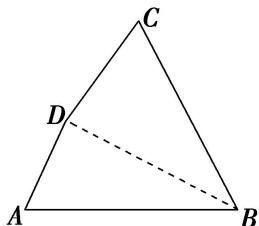
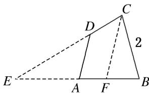

> [!faq]- 《专题4 三角形中的最值(范围)问题-解三角形》例题解析
>
> > [!success]- **【答案】** B
>
> > [!note]- **【分析】**
> > 本题未单列分析。
>
> > [!note]- **【解析】**
> > 答案 2 解析 $\because A, \frac{3}{2} B, C$ 成等差数列， $\therefore A + C = 3B$ ，又 $A + B + C = \pi$ ， $\therefore B = \frac{\pi}{4}$ 。设角 $A, B, C$ 所对的边分别为 $a, b, c$ ，由 $S_{\triangle ABC} = \frac{1}{2} ac \sin B = 1 + \sqrt{2}$ 得 $ac = 2(2 + \sqrt{2})$ ，由余弦定理及 $a^2 + c^2 \geq 2ac$ ，得 $b^2 \geq (2 - \sqrt{2})ac$ ，即 $b^2 \geq (2 - \sqrt{2}) \times 2(2 + \sqrt{2})$ ， $\therefore b \geq 2$ （当且仅当 $a = c$ 时等号成立）， $\therefore AC$ 边的长的最小值为 2.
> > (2)(2015·全国Ⅰ)在平面四边形ABCD中, $\angle A = \angle B = \angle C = 75^{\circ}, BC = 2$ , 则 $AB$ 的取值范围是\_\_\_\_. 答案 $(\sqrt{6} - \sqrt{2}, \sqrt{6} + \sqrt{2})$ 解析 通法: 依题意作出四边形ABCD, 连结 $BD$ . 令 $BD = x, AB = y, \angle CDB = \alpha, \angle CBD = \beta$ . 在△BCD中, 由正弦定理得 $\frac{2}{\sin \alpha} = \frac{x}{\sin 75}$ . 由题意可知, $\angle ADC = 135^{\circ}$ , 则∠ADB$= 135^{\circ} - \alpha$ . 在 $\triangle ABD$ 中，由正弦定理得 $\frac{x}{\sin 75^{\circ}} = \frac{y}{\sin(135^{\circ} - \alpha)}$ . 所以 $\frac{y}{\sin(135^{\circ} - \alpha)} = \frac{2}{\sin \alpha}$ ，即 $y = \frac{2\sin(135^{\circ} - \alpha)}{\sin \alpha} = \frac{2\sin[90^{\circ} - (\alpha - 45^{\circ})]}{\sin \alpha} = \frac{2\cos(\alpha - 45^{\circ})}{\sin \alpha} = \frac{\sqrt{2}(\cos \alpha + \sin \alpha)}{\sin \alpha}$ . 因为 $0^{\circ} < \beta < 75^{\circ}, \alpha + \beta + 75^{\circ} = 180^{\circ}$ ，所以 $30^{\circ} < \alpha < 105^{\circ}$ ，当 $\alpha = 90^{\circ}$ 时，易得 $y = \sqrt{2}$ ；当 $\alpha \neq 90^{\circ}$ 时， $y = \frac{\sqrt{2}(\cos \alpha + \sin \alpha)}{\sin \alpha} = \sqrt{2}\left(\frac{1}{\tan \alpha} + 1\right)$ . 又 $\tan 30^{\circ} = \frac{\sqrt{3}}{3}$ ， $\tan 105^{\circ} = \tan (60^{\circ} + 45^{\circ}) = \frac{\tan 60^{\circ} + \tan 45^{\circ}}{1 - \tan 60^{\circ} \tan 45^{\circ}} = -2 - \sqrt{3}$ ，结合正切函数的性质知， $\frac{1}{\tan \alpha} \in (\sqrt{3} - 2, \sqrt{3})$ ，且 $\frac{1}{\tan \alpha} \neq 0$ ，所以 $y = \sqrt{2}\left(\frac{1}{\tan \alpha} + 1\right) \in (\sqrt{6} - \sqrt{2}, \sqrt{2}) \cup (\sqrt{2}, \sqrt{6} + \sqrt{2})$ 。综上所述： $y \in (\sqrt{6} - \sqrt{2}, \sqrt{6} + \sqrt{2})$ 。
> > 
> > 提速方法：画出四边形 $ABCD$ ，延长 $CD$ ， $BA$ ，探求出 $AB$ 的取值范围。如图所示，延长 $BA$ 与 $CD$ 相交于点 $E$ ，过点 $C$ 作 $CF \parallel AD$ 交 $AB$ 于点 $F$ ，则 $BF < AB < BE$ 。在等腰三角形 $CFB$ 中， $\angle FCB = 30^\circ$ ， $CF = BC = 2$ ， $\therefore BF = \sqrt{2^2 + 2^2 - 2 \times 2 \times 2 \cos 30^\circ} = \sqrt{6} - \sqrt{2}$ 。在等腰三角形 $ECB$ 中， $\angle CEB = 30^\circ$ ， $\angle ECB = 75^\circ$ ， $BE = CE$ ， $BC = 2$ ， $\frac{BE}{\sin 75^\circ} = \frac{2}{\sin 30^\circ}$ ， $\therefore BE = \frac{2}{\frac{1}{2}} \times \frac{\sqrt{6} + \sqrt{2}}{4} = \sqrt{6} + \sqrt{2}$ 。 $\therefore \sqrt{6} - \sqrt{2} < AB < \sqrt{6} + \sqrt{2}$ 。
> > 
> > (3)在 $\triangle ABC$ 中，若 $C=2B$ ，则 $\frac{c}{b}$ 的取值范围为\_\_\_\_.
> > 答案 (1, 2) 解析 因为 $A + B + C = \pi$ , $C = 2B$ , 所以 $A = \pi - 3B > 0$ , 所以 $0 < B < \frac{\pi}{3}$ , 所以 $\frac{1}{2} < \cos B < 1$ . 因为 $\frac{c}{b} = \frac{\sin C}{\sin B} = \frac{\sin 2B}{\sin B} = 2\cos B$ , 所以 $1 < 2\cos B < 2$ , 故 $1 < \frac{c}{b} < 2$ .
> > (4) (2018·北京) 若 $\triangle ABC$ 的面积为 $\frac{\sqrt{3}}{4} (a^2 + c^2 - b^2)$ , 且 $\angle C$ 为钝角, 则 $\angle B =$ \_\_\_\_; $\frac{c}{a}$ 的取值范围是 \_\_\_\_.
> > 答案 $60^{\circ}$ $(2, +\infty)$ 解析 由已知得 $\frac{\sqrt{3}}{4} (a^{2} + c^{2} - b^{2}) = \frac{1}{2} ac\sin B$ ，所以 $\frac{\sqrt{3}(a^2 + c^2 - b^2)}{2ac} = \sin B$ ，由余弦定理得 $\sqrt{3}\cos B = \sin B$ ，所以 $\tan B = \sqrt{3}$ ，所以 $B = 60^{\circ}$ ，又 $C > 90^{\circ}$ ， $B = 60^{\circ}$ ，所以 $A < 30^{\circ}$ ，且 $A + C = 120^{\circ}$ ，所以 $\frac{c}{a} = \frac{\sin C}{\sin A} = \frac{\sin(120^{\circ} - A)}{\sin A} = \frac{1}{2} + \frac{\sqrt{3}}{2\tan A}$ . 又 $A < 30^{\circ}$ ，所以 $0 < \tan A < \frac{\sqrt{3}}{3}$ ，即 $\frac{1}{\tan A} >\sqrt{3}$ ，所以 $\frac{c}{a} >\frac{1}{2} + \frac{3}{2} = 2$ .
> > (5)在 $\triangle ABC$ 中，角 $A, B, C$ 所对的边分别为 $a, b, c$ ，且满足 $\sin A \sin(B-C)=\sin B \sin C \cos A$ ，则 $\frac{ab}{c^{2}}$ 的最大值为\_\_\_\_.
> > 答案 $\frac{3}{2}$ 解析 由 $\sin A\sin (B - C) = \sin B\sin C\cos A$ ，得 $\sin A(\sin B\cos C - \cos B\sin C) = \sin B\sin C\cos A$ ，由正弦定理可得 $ab\cos C - ac\cos B = bc\cos A$ ，由余弦定理可得 $ab\frac{a^2 + b^2 - c^2}{2ab} -ac\frac{a^2 + c^2 - b^2}{2ac} = bc\frac{b^2 + c^2 - a^2}{2bc}$ ，化简得 $a^2 +b^2 = 3c^2$ ，又因为 $3c^{2} = a^{2} + b^{2}\geqslant 2ab$ ，当且仅当 $a = b$ 时等号成立，可得 $\frac{ab}{c^2}\leqslant \frac{3}{2}$ ，所以 $\frac{ab}{c^2}$ 的最大值为 $\frac{3}{2}$ ：
> > (6)在 $\triangle ABC$ 中，若 $C=60^{\circ}$ ， $c=2$ ，则 $a+b$ 的取值范围为\_\_\_\_.
> > 答案 (2, 4] 解析 由题意，得 $c = 2$ 。由余弦定理可得 $c^2 = a^2 + b^2 - 2ab\cos C$ ，即 $4 = a^2 + b^2 - ab = (a + b)^2 - 3ab \geq \frac{1}{4}(a + b)^2$ ，得 $a + b \leq 4$ 。又由三角形的性质可得 $a + b > 2$ ，综上可得 $2 < a + b \leq 4$ 。
> > (7)在 $\triangle ABC$ 中，角 $A, B, C$ 所对的边分别为 $a, b, c$ ，且满足 $b^{2}+c^{2}-a^{2}=bc$ ， $\overrightarrow{AB}\cdot\overrightarrow{BC}>0$ ， $a=\frac{\sqrt{3}}{2}$ ，则 $b+c$ 的取值范围是（）A. $\left(1, \frac{3}{2}\right)$ B. $\left(\frac{\sqrt{3}}{2}, \frac{3}{2}\right)$ C. $\left(\frac{1}{2}, \frac{3}{2}\right)$ D. $\left(\frac{1}{2}, \frac{3}{2}\right]$
> > 答案 B 解析 在 $\triangle ABC$ 中， $b^{2}+c^{2}-a^{2}=bc$ ，由余弦定理可得 $\cos A=\frac{b^{2}+c^{2}-a^{2}}{2bc}=\frac{bc}{2bc}=\frac{1}{2}$ ，因为 $A$ 是 $\triangle ABC$ 的内角，所以 $A=60^{\circ}$ 。因为 $a=\frac{\sqrt{3}}{2}$ ，所以由正弦定理得 $\frac{a}{\sin A}=\frac{b}{\sin B}=\frac{c}{\sin C}=\frac{c}{\sin(120^{\circ}-B)}=1$ ，所以 $b+c=\sin B+\sin(120^{\circ}-B)=\frac{3}{2}\sin B+\frac{\sqrt{3}}{2}\cos B=\sqrt{3}\sin(B+30^{\circ})$ 。因为 $\overrightarrow{AB}\cdot\overrightarrow{BC}=|\overrightarrow{AB}|\cdot|\overrightarrow{BC}|\cdot\cos(\pi-B)>0$ ，所以 $\cos B<0$ ， $B$ 为钝角，所以 $90^{\circ}<B<120^{\circ}$ ， $120^{\circ}<B+30^{\circ}<150^{\circ}$ ，故 $\sin(B+30^{\circ})\in\left(\frac{1}{2}, \frac{\sqrt{3}}{2}\right)$ ，所以 $b+c=\sqrt{3}\sin(B+30^{\circ})\in\left(\frac{\sqrt{3}}{2}, \frac{3}{2}\right)$ 。
> > (8) (2018·江苏) 在 $\triangle ABC$ 中, 角 $A, B, C$ 所对的边分别为 $a, b, c, \angle ABC = 120^{\circ}$ , $\angle ABC$ 的平分线交 $AC$ 于点 $D$ , 且 $BD = 1$ , 则 $4a + c$ 的最小值为 \_\_\_\_.
> > 答案 9 解析 因为 $\angle ABC = 120^{\circ}$ , $\angle ABC$ 的平分线交 $AC$ 于点 $D$ , 所以 $\angle ABD = \angle CBD = 60^{\circ}$ , 由三角形的面积公式可得 $\frac{1}{2} ac\sin 120^{\circ} = \frac{1}{2} a \times 1 \times \sin 60^{\circ} + \frac{1}{2} c \times 1 \times \sin 60^{\circ}$ , 化简得 $ac = a + c$ , 又 $a > 0$ , $c > 0$ , 所以 $\frac{1}{a} + \frac{1}{c} = 1$ , 则 $4a + c = (4a + c) \cdot \left( \frac{1}{a} + \frac{1}{c} \right) = 5 + \frac{c}{a} + \frac{4a}{c} \geqslant 5 + 2\sqrt{\frac{c}{a} \cdot \frac{4a}{c}} = 9$ , 当且仅当 $c = 2a$ 时取等号, 故 $4a + c$ 的最小值为 9.
> > (9)在 $\triangle ABC$ 中，角 $A$ ， $B$ ， $C$ 所对的边分别为 $a$ ， $b$ ， $c$ ，且满足 $a\sin B=\sqrt{3}b\cos A$ ．若 $a=4$ ，则 $\triangle ABC$ 周长的最大值为\_\_\_\_．
> > 答案 12 解析 由正弦定理 $\frac{a}{\sin A} = \frac{b}{\sin B}$ , 可将 $a \sin B = \sqrt{3} b \cos A$ 转化为 $\sin A \sin B = \sqrt{3} \sin B \cos A$ . 又在 $\triangle ABC$ 中, $\sin B > 0$ , $\therefore \sin A = \sqrt{3} \cos A$ , 即 $\tan A = \sqrt{3}$ . $\because 0 < A < \pi$ , $\therefore A = \frac{\pi}{3}$ . 由余弦定理得 $a^2 = 16 = b^2 + c^2 - 2bc \cos A = (b + c)^2 - 3bc \geqslant (b + c)^2 - 3\left(\frac{b + c}{2}\right)^2$ , 则 $(b + c)^2 \leqslant 64$ , 即 $b + c \leqslant 8$ (当且仅当 $b = c = 4$ 时等号成立), $\therefore \triangle ABC$ 周长 $= a + b + c = 4 + b + c \leqslant 12$ , 即最大值为 12.
> > (10)在 $\triangle ABC$ 中， $\angle ACB=60^{\circ}$ ， $BC>1$ ， $AC=AB+\frac{1}{2}$ ，当 $\triangle ABC$ 的周长最短时， $BC$ 的长是\_\_\_\_.
> > 答案 $1+\frac{\sqrt{2}}{2}$ 解析 设 $AC=b$ ， $AB=c$ ， $BC=a$ ， $\triangle ABC$ 的周长为 $l$ ，由 $b=c+\frac{1}{2}$ ，得 $l=a+b+c=a+2c+\frac{1}{2}$ . 又 $\cos 60^{\circ}=\frac{a^{2}+b^{2}-c^{2}}{2ab}=\frac{1}{2}$ ，即 $ab=a^{2}+b^{2}-c^{2}$ ，得 $a\left(c+\frac{1}{2}\right)=a^{2}+\left(c+\frac{1}{2}\right)^{2}-c^{2}$ ，即 $c=\frac{a^{2}-\frac{1}{2}a+\frac{1}{4}}{a-1}$ . $l=a+2c+\frac{1}{2}=a+\frac{2a^{2}-a+\frac{1}{2}}{a-1}+\frac{1}{2}=\frac{3\left[(a-1)^{2}+\frac{4}{3}(a-1)+\frac{1}{2}\right]}{a-1}+\frac{1}{2}=3\left[(a-1)+\frac{1}{2(a-1)}+\frac{4}{3}\right]+\frac{1}{2}\geqslant3\left[2\sqrt{(a-1)\times\frac{1}{2(a-1)}}+\frac{4}{3}\right]+\frac{1}{2}$ ，当且仅当 $a-1=\frac{1}{2(a-1)}$ 时， $\triangle ABC$ 的周长最短，此时 $a=1+\frac{\sqrt{2}}{2}$ ，即 $BC$ 的长是 $1+\frac{\sqrt{2}}{2}$ .
> > ## 【对点训练】
