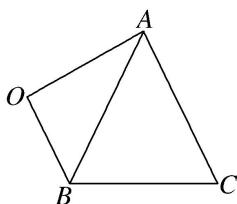

> [!faq]- 《专题4 三角形中的最值(范围)问题-解三角形》例题解析
>
> > [!success]- **【答案】** B
>
> > [!note]- **【分析】**
> > 本题未单列分析。
>
> > [!note]- **【解析】**
> > 答案 C 解析 因为 $\tan A=\frac{4}{3}$ ，所以 $\frac{\sin A}{\cos A}=\frac{4}{3}$ 。又 $\sin^{2}A+\cos^{2}A=1$ ，所以 $\cos^{2}A=\frac{9}{25}$ ，解得 $\cos A=\frac{3}{5}$ 或 $\cos A=-\frac{3}{5}$ （舍去），故 $\sin A=\frac{4}{5}$ 。又 $16=b^{2}+c^{2}-2bc\times\frac{3}{5}\geqslant2bc-\frac{6}{5}bc$ ，所以 $bc\leqslant20$ ，当且仅当 $b=c=2\sqrt{5}$ 时取等号，故 $\triangle ABC$ 的面积的最大值为 $\frac{1}{2}\times20\times\frac{4}{5}=8$ 。
> > (2)在 $\triangle ABC$ 中，三个内角 $A, B, C$ 的对边分别为 $a, b, c$ ，若 $\left(\frac{1}{2}b - \sin C\right)\cos A = \sin A\cos C$ ，且 $a = 2\sqrt{3}$ ，则 $\triangle ABC$ 面积的最大值为\_\_\_\_.
> > 答案 $3\sqrt{3}$ 解析 因为 $\left(\frac{1}{2} b - \sin C\right)\cos A = \sin A\cos C$ ，所以 $\frac{1}{2} b\cos A - \sin C\cos A = \sin A\cos C$ ，所以 $\frac{1}{2} b\cos A = \sin (A + C)$ ，所以 $\frac{1}{2} b\cos A = \sin B$ ，所以 $\frac{\cos A}{2} = \frac{\sin B}{b}$ ，又 $\frac{\sin B}{b} = \frac{\sin A}{a}$ ， $a = 2\sqrt{3}$ ，所以 $\frac{\cos A}{2} = \frac{\sin A}{2\sqrt{3}}$ ，得 $\tan A = \sqrt{3}$ ，又 $A \in (0, \pi)$ ，则 $A = \frac{\pi}{3}$ ，由余弦定理得 $(2\sqrt{3})^2 = b^2 + c^2 - 2bc \cdot \frac{1}{2} = b^2 + c^2 - bc \geqslant 2bc - bc = bc$ ，即 $bc \leqslant 12$ 当且仅当 $b = c = 2\sqrt{3}$ 时取等号，从而 $\triangle ABC$ 面积的最大值为 $\frac{1}{2} \times 12 \times \frac{\sqrt{3}}{2} = 3\sqrt{3}$ .
> > (3)已知 $\triangle ABC$ 的三个内角 $A, B, C$ 的对边分别为 $a, b, c$ , 面积为 $S$ , 且满足 $4S=a^{2}-(b-c)^{2}, b+c=8$ , 则 $S$ 的最大值为\_\_\_\_.
> > 答案 8 解析 由题意得， $4 \times \frac{1}{2} b c \sin A = a^{2} - b^{2} - c^{2} + 2 b c$ ，又 $a^{2} = b^{2} + c^{2} - 2 b c \cos A$ ，代入上式得， $2 b c \sin A = -2 b c \cos A + 2 b c$ ，即 $\sin A + \cos A = 1$ ， $\sqrt{2} \sin \left( A + \frac{\pi}{4} \right) = 1$ ，又 $0 < A < \pi$ ， $\therefore \frac{\pi}{4} < A + \frac{\pi}{4} < \frac{5\pi}{4}$ ， $\therefore A + \frac{\pi}{4} = \frac{3\pi}{4}$ ， $\therefore A = \frac{\pi}{2}$ ， $S = \frac{1}{2} b c \sin A = \frac{1}{2} b c$ ，又 $b + c = 8 \geqslant 2\sqrt{bc}$ ，当且仅当 b = c 时取 “=”， $\therefore bc \leqslant 16$ ， $\therefore S$ 的最大值为 8.
> > (4)若 $\triangle ABC$ 的三边长分别为 $a, b, c$ , 面积为 $S$ , 且 $S=c^{2}-(a-b)^{2}, a+b=2$ , 则 $\triangle ABC$ 面积的最大值为\_\_\_\_.
> > 答案 $\frac{4}{17}$ 解析 $S = c^{2} - (a - b)^{2} = c^{2} - a^{2} - b^{2} + 2ab = 2ab - (a^{2} + b^{2} - c^{2})$ ，由余弦定理得 $a^{2} + b^{2} - c^{2} = 2ab\cos C$ ， $\therefore c^{2} - (a - b)^{2} = 2ab(1 - \cos C)$ ，即 $S = 2ab(1 - \cos C)$ . $\because S = \frac{1}{2} ab\sin C$ ， $\therefore \sin C = 4(1 - \cos C)$ . 又 $\because \sin^2 C + \cos^2 C = 1$ ， $\therefore 17\cos^2 C - 32\cos C + 15 = 0$ ，解得 $\cos C = \frac{15}{17}$ 或 $\cos C = 1$ （舍去）， $\therefore \sin C = \frac{8}{17}$ ， $\therefore S = \frac{1}{2} ab\sin C = \frac{4}{17} a(2 - a) = -\frac{4}{17}(a - 1)^{2} + \frac{4}{17}$ . $\because a + b = 2$ ， $\therefore 0 < a < 2$ ， $\therefore$ 当 $a = 1$ ， $b = 1$ 时， $S_{\max} = \frac{4}{17}$ .
> > (5)已知 $\triangle ABC$ 的外接圆半径为 $R$ , 且满足 $2R(\sin^{2}A-\sin^{2}C)=(\sqrt{2}a-b)\cdot\sin B$ , 则 $\triangle ABC$ 面积的最大值为\_\_\_\_.
> > 答案 $\frac{\sqrt{2} + 1}{2} R^2$ 解析 由正弦定理得 $a^2 - c^2 = (\sqrt{2} a - b)b$ ，即 $a^2 + b^2 - c^2 = \sqrt{2} ab$ 。由余弦定理得 $\cos C = \frac{a^2 + b^2 - c^2}{2ab} = \frac{\sqrt{2}ab}{2ab} = \frac{\sqrt{2}}{2}$ ， $\because C \in (0, \pi)$ ， $\therefore C = \frac{\pi}{4}$ 。 $\therefore S = \frac{1}{2} ab \sin C = \frac{1}{2} \times 2R \sin A \cdot 2R \sin B \cdot \frac{\sqrt{2}}{2} = \sqrt{2} R^2 \sin A \sin B = \sqrt{2} R^2 \sin A \sin \left(\frac{3\pi}{4} - A\right) = \sqrt{2} R^2 \sin A \left(\frac{\sqrt{2}}{2} \cos A + \frac{\sqrt{2}}{2} \sin A\right) = R^2 (\sin A \cos A + \sin^2 A) = R^2 \left(\frac{1}{2} \sin 2A + \frac{1 - \cos 2A}{2}\right) = R^2 \left[\frac{\sqrt{2}}{2} \sin \left(2A - \frac{\pi}{4}\right) + \frac{1}{2}\right]$ ， $\therefore A \in \left(0, \frac{3\pi}{4}\right)$ ， $\therefore 2A - \frac{\pi}{4} \in \left(-\frac{\pi}{4}, \frac{5\pi}{4}\right)$ ， $\therefore \sin \left(2A - \frac{\pi}{4}\right) \in \left(-\frac{\sqrt{2}}{2}, 1\right)$ ， $\therefore S \in \left(0, \frac{\sqrt{2} + 1}{2} R^2\right)$ ， $\therefore$ 面积 $S$ 的最大值为 $\frac{\sqrt{2} + 1}{2} R^2$ 。
> > (6)在 $\triangle ABC$ 中，内角 $A$ ， $B$ ， $C$ 的对边分别为 $a$ ， $b$ ， $c$ ，且满足 $b=c$ ， $\frac{b}{a}=\frac{1-\cos B}{\cos A}$ ．若点 $O$ 是 $\triangle ABC$ 外一点， $\angle AOB=\theta(0<\theta<\pi)$ ， $OA=2$ ， $OB=1$ ，如图所示，则四边形 $OACB$ 面积的最大值是（）
> > 
> > A. $\frac{4 + 5\sqrt{3}}{4}$ B. $\frac{8 + 5\sqrt{3}}{4}$ C. 3 D. $\frac{4 + \sqrt{5}}{2}$
> > 答案 B 解析 由 $\frac{b}{a} = \frac{1 - \cos B}{\cos A}$ 及正弦定理得 $\sin B\cos A = \sin A - \sin A\cos B$ ，所以 $\sin (A + B) = \sin A$ ，所以 $\sin C = \sin A$ ，因为 $A, C \in (0, \pi)$ ，所以 $C = A$ ，又 $b = c$ ，所以 $A = B = C$ ， $\triangle ABC$ 为等边三角形。设 $\triangle ABC$ 的边长为 $k$ ，则 $k^2 = 1^2 + 2^2 - 2 \times 1 \times 2 \times \cos \theta = 5 - 4\cos \theta$ ，则 $S_{\text{四边形 } OACB} = \frac{1}{2} \times 1 \times 2\sin \theta + \frac{\sqrt{3}}{4} k^2 = \sin \theta + \frac{\sqrt{3}}{4}(5 - 4\cos \theta) = 2\sin \left(\theta - \frac{\pi}{3}\right) + \frac{5\sqrt{3}}{4} \leq 2 + \frac{5\sqrt{3}}{4} = \frac{8 + 5\sqrt{3}}{4}$ ，所以当 $\theta - \frac{\pi}{3} = \frac{\pi}{2}$ ，即 $\theta = \frac{5\pi}{6}$ 时，四边形 $OACB$ 的面积取得最大值，且最大值为 $\frac{8 + 5\sqrt{3}}{4}$ 。
> > ## 【对点训练】
