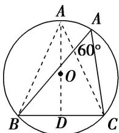

> [!faq]- 《专题4 三角形中的最值(范围)问题-解三角形》例题解析
>
> > [!success]- **【答案】** 详见解析
>
> > [!note]- **【分析】**
> > 本题未单列分析。
>
> > [!note]- **【解析】**
> > 答案 $\sqrt{3}$ 解析 通性通法 $\because \frac{a}{\sin A} = \frac{b}{\sin B} = \frac{c}{\sin C} = 2R, a = 2,$ 又 $(2 + b)\cdot (\sin A - \sin B) = (c - b)\sin C$ 可化为 $(a + b)(a - b) = (c - b)\cdot c,\therefore a^2 -b^2 = c^2 -bc,\therefore b^2 +c^2 -a^2 = bc,\therefore \frac{b^2 + c^2 - a^2}{2bc} = \frac{bc}{2bc} = \frac{1}{2} = \cos A,\therefore$ $\angle A = 60^{\circ}$ ： $\because \triangle ABC$ 中， $4 = a^{2} = b^{2} + c^{2} - 2bc\cdot \cos 60^{\circ} = b^{2} + c^{2} - bc\geq 2bc - bc = bc(" = "当且仅当b = c时取得),\therefore S_{\triangle ABC} = \frac{1}{2}\cdot bc\cdot \sin A\leq \frac{1}{2}\times 4\times \frac{\sqrt{3}}{2} = \sqrt{3}.$
> > 提速方法 $\because a = 2$ ，由 $(2 + b)(\sin A - \sin B) = (c - b)\sin C$ ，得 $(a + b)(a - b) = (c - b)\cdot c$ ，得 $b^{2} + c^{2} - a^{2} = bc$ ， $\therefore \cos A = \frac{b^{2} + c^{2} - a^{2}}{2bc} = \frac{1}{2}, A \in (0^{\circ}, 180^{\circ}), \therefore A = 60^{\circ}$ 。如图， $\triangle ABC$ 外接圆为 $\odot O$ ，要使 $S_{\triangle ABC}$ 最大，只有当 $a$ 边上的高过圆心 $O$ 时，此时 $AD = \sqrt{3}$ ， $S_{\triangle ABC\max} = \frac{1}{2} \times 2 \times \sqrt{3} = \sqrt{3}$ 。
> > 
