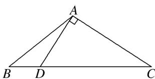

> [!faq]- 《专题6 三角形中面积的计算问题-解三角形》例题解析
>
> > [!success]- **【答案】** 详见解析
>
> > [!note]- **【分析】**
> > 本题未单列分析。
>
> > [!note]- **【解析】**
> > (1)求 $AD$ 的长；
> > (2)求 $\triangle ABC$ 的面积.
> > 
> > 解析 (1) 因为 $AD \perp AC$ ， $\cos \angle BAC = -\frac{1}{3}$ ，所以 $\sin \angle BAC = \frac{2\sqrt{2}}{3}$ .
> > 又 $\sin\angle BAC=\sin\left(\frac{\pi}{2}+\angle BAD\right)=\cos\angle BAD=\frac{2\sqrt{2}}{3},$
> > 在 $\triangle ABD$ 中， $BD^{2}=AB^{2}+AD^{2}-2AB\cdot AD\cdot\cos\angle BAD$ ，即 $AD^{2}-8AD+15=0$ ，
> > 解得 AD=5 或 AD=3，由于 AB>AD，所以 AD=3。
> > (2)在 $\triangle ABD$ 中， $\frac{BD}{\sin\angle BAD}=\frac{AB}{\sin\angle ADB}$ ，又由 $\cos\angle BAD=\frac{2\sqrt{2}}{3}$ ，得 $\sin\angle BAD=\frac{1}{3}$ ，所以 $\sin\angle ADB=\frac{\sqrt{6}}{3}$ ，
> > $$
> > \sin \angle A D C = \sin (\pi - \angle A D B) = \sin \angle A D B = \frac {\sqrt {6}}{3}
> > $$
> > 因为 $\angle ADB = \angle DAC + \angle C = \frac{\pi}{2} + \angle C$ ，所以 $\cos \angle C = \frac{\sqrt{6}}{3}$ .
> > 在 Rt△ADC 中， $\cos\angle C=\frac{\sqrt{6}}{3}$ ，则 $\tan\angle C=\frac{\sqrt{2}}{2}=\frac{AD}{AC}=\frac{3}{AC}$ ，所以 $AC=3\sqrt{2}$ .
> > 则 $\triangle ABC$ 的面积 $S = \frac{1}{2} AB\cdot AC\cdot \sin \angle BAC = \frac{1}{2}\times 3\sqrt{2}\times 3\sqrt{2}\times \frac{2\sqrt{2}}{3} = 6\sqrt{2}.$
