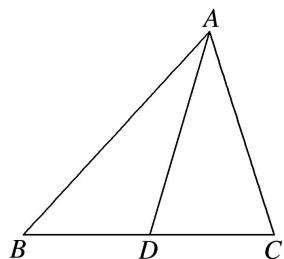

> [!faq]- 《专题6 三角形中面积的计算问题-解三角形》例题解析
>
> > [!success]- **【答案】** 详见解析
>
> > [!note]- **【分析】**
> > 本题未单列分析。
>
> > [!note]- **【解析】**
> > (1)求 $A$ ;
> > (2)若 $AD$ 为 $BC$ 边上的中线， $\cos B = \frac{1}{7}$ ， $AD = \frac{\sqrt{129}}{2}$ ，求△ABC的面积.
> > 
> > 10. 解析 (1) $a\cos C + \sqrt{3}a\sin C - b - c = 0$ ，由正弦定理得 $\sin A\cos C + \sqrt{3}\sin A\sin C = \sin B + \sin C$ ，即 $\sin A\cos C + \sqrt{3}\sin A\sin C = \sin (A + C) + \sin C$ ，
> > 亦即 $\sin A\cos C + \sqrt{3}\sin A\sin C = \sin A\cos C + \cos A\sin C + \sin C$ ，则 $\sqrt{3}\sin A\sin C - \cos A\sin C = \sin C$ 。又 $\sin C \neq 0$ ，所以 $\sqrt{3}\sin A - \cos A = 1$ ，所以 $\sin(A - 30^{\circ}) = \frac{1}{2}$ .
> > 在 $\triangle ABC$ 中， $0^{\circ}<A<180^{\circ}$ ，则 $-30^{\circ}<A-30^{\circ}<150^{\circ}$ ，所以 $A-30^{\circ}=30^{\circ}$ ，得 $A=60^{\circ}$ .
> > (2)在 $\triangle ABC$ 中，因为 $\cos B=\frac{1}{7}$ ，所以 $\sin B=\frac{4\sqrt{3}}{7}$ ．所以 $\sin C=\sin(A+B)=\frac{\sqrt{3}}{2}\times\frac{1}{7}+\frac{1}{2}\times\frac{4\sqrt{3}}{7}=\frac{5\sqrt{3}}{14}$ ．由正弦定理，得 $\frac{a}{c}=\frac{\sin A}{\sin C}=\frac{7}{5}$ ．设 $a=7x$ ， $c=5x(x>0)$ ，则在 $\triangle ABD$ 中， $AD^{2}=AB^{2}+BD^{2}-2AB\cdot BD\cos B$ ，即 $\frac{129}{4}=25x^{2}+\frac{1}{4}\times49x^{2}-2\times5x\times\frac{1}{2}\times7x\times\frac{1}{7}$ ，解得 $x=1$ （负值舍去），所以 $a=7$ ， $c=5$ ，故 $S_{\triangle ABC}=\frac{1}{2}ac\sin B=10\sqrt{3}$ ．
