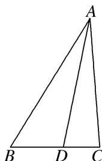

<!-- question-source:start -->
[例 1]如图，在 $\triangle ABC$ 中， $\angle B=\frac{\pi}{3}$ ，AB=8，点D在边BC上，且CD=2， $\cos\angle ADC=\frac{1}{7}$ .

(1)求 $\sin \angle BAD$ ;

(2)求 $BD$ ， $AC$ 的长.

<!-- question-source:end -->

![[高中/总复习/专题/解三角形/专题8 多三角形问题-解三角形/专题8_多三角形问题/例题/answers/Q00044939A1.md]]
