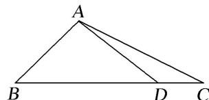

<!-- question-source:start -->
[例 2] (2020·江苏) 在 $\triangle ABC$ 中，角 $A, B, C$ 的对边分别为 $a, b, c$ 。已知 $a=3, c=\sqrt{2}, B=45^\circ$ .

(1)求 $\sin C$ 的值；

(2)在边 $BC$ 上取一点 $D$ ，使得 $\cos \angle ADC = -\frac{4}{5}$ ，求 $\tan \angle DAC$ 的值.

<!-- question-source:end -->

![[高中/总复习/专题/解三角形/专题8 多三角形问题-解三角形/专题8_多三角形问题/例题/answers/Q00044940A1.md]]
