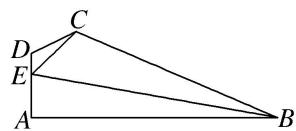

<!-- question-source:start -->
5. 如图，在平面四边形 $ABCD$ 中， $DA \perp AB$ ， $DE = 1$ ， $EC = \sqrt{7}$ ， $EA = 2$ ， $\angle ADC = \frac{2\pi}{3}$ ，且 $\angle CBE$ ， $\angle BEC$ ， $\angle BCE$ 成等差数列.
(1) 求 $\sin \angle CED$ ;
(2) 求 $BE$ 的长.

<!-- question-source:end -->

![[高中/总复习/专题/解三角形/专题8 多三角形问题-解三角形/专题8_多三角形问题/对点训练/answers/Q00044948A1.md]]
