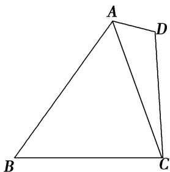

<!-- question-source:start -->
6. 如图所示，在四边形 $ABCD$ 中， $\angle D = 2\angle B$ ，且 $AD = 1$ ， $CD = 3$ ， $\cos B = \frac{\sqrt{3}}{3}$ .

(1)求 $\triangle ACD$ 的面积;

(2)若 $BC = 2\sqrt{3}$ ，求 $AB$ 的长.

<!-- question-source:end -->

![[高中/总复习/专题/解三角形/专题8 多三角形问题-解三角形/专题8_多三角形问题/对点训练/answers/Q00044949A1.md]]
