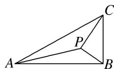

> [!faq]- 《专题8 多三角形问题-解三角形》例题解析
>
> > [!success]- **【答案】** 详见解析
>
> > [!note]- **【分析】**
> > 本题未单列分析。
>
> > [!note]- **【解析】**
> > (1)若 $PB = \frac{1}{2}$ ，求 $PA$
> > (2)若 $\angle APB = 150^{\circ}$ ，求 $\tan \angle PBA$
> > 
> > 1. 解析
> > (1)由已知得, $\angle PBC = 60^{\circ}$ , 所以 $\angle PBA = 30^{\circ}$ .
> > 在 $\triangle PBA$ 中，由余弦定理得 $PA^{2}=AB^{2}+PB^{2}-2AB\cdot PB\cos\angle PBA=3+\frac{1}{4}-2\times\sqrt{3}\times\frac{1}{2}\cos30^{\circ}=\frac{7}{4}$ 。故 $PA=\frac{\sqrt{7}}{2}$ 。
> > (2)设 $\angle PBA = \alpha$ ，由已知得 $\frac{PB}{BC} = \cos \left(\frac{\pi}{2} -\alpha\right)$ 即 $PB = \sin \alpha .$
> > 在 $\triangle PBA$ 中，由正弦定理得 $\frac{\sqrt{3}}{\sin 150^{\circ}} = \frac{\sin \alpha}{\sin (30^{\circ} - \alpha)}$ ，化简得 $\sqrt{3}\cos \alpha = 4\sin \alpha$
> > 所以 $\tan\alpha=\frac{\sqrt{3}}{4}$ ，即 $\tan\angle PBA=\frac{\sqrt{3}}{4}$ .
