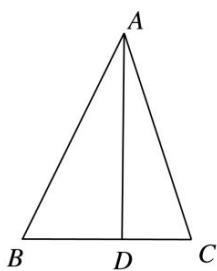
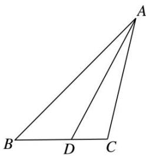

> [!faq]- 《专题8 多三角形问题-解三角形》例题解析
>
> > [!success]- **【答案】** 详见解析
>
> > [!note]- **【分析】**
> > 本题未单列分析。
>
> > [!note]- **【解析】**
> > (1)如图1，若 $AD \perp BC$ ，求 $\angle BAC$ 的大小；
> >
> > (2)如图2，若 $\angle ABC = \frac{\pi}{4}$ ，求△ADC的面积.
> >
> > 
> >
> >   
> > 图1  
> > 图2
> >
> > 2. 解析
> > (1) 设 $\angle BAD = \alpha, \angle DAC = \beta$ . 因为 $AD \perp BC, AD = 6, BD = 3, DC = 2$ ,
> >
> > 所以 $\tan\alpha=\frac{1}{2}$ ， $\tan\beta=\frac{1}{3}$ ，所以 $\tan\angle BAC=\tan(\alpha+\beta)=\frac{\tan\alpha+\tan\beta}{1-\tan\alpha\tan\beta}=\frac{\frac{1}{2}+\frac{1}{3}}{1-\frac{1}{2}\times\frac{1}{3}}=1$ .
> >
> > 又 $\angle BAC\in (0,\pi)$ ，所以 $\angle BAC = \frac{\pi}{4}$
> >
> > (2)设 $\angle BAD = \alpha$ ，在 $\triangle ABD$ 中， $\angle ABC = \frac{\pi}{4}$ $AD = 6$ ， $BD = 3$
> >
> > 由正弦定理得 $\frac{AD}{\sin\frac{\pi}{4}}=\frac{BD}{\sin\alpha}$ ，解得 $\sin\alpha=\frac{\sqrt{2}}{4}$ .
> >
> > 因为 $AD > BD$ ，所以 $\alpha$ 为锐角，从而 $\cos \alpha = \sqrt{1 - \sin^2\alpha} = \frac{\sqrt{14}}{4}$
> >
> > $$
> > \sin \angle A D C = \sin \left(\alpha + \frac {\pi}{4}\right) = \sin \alpha \cos \frac {\pi}{4} + \cos \alpha \sin \frac {\pi}{4} = \frac {\sqrt {2}}{2} \left(\frac {\sqrt {2}}{4} + \frac {\sqrt {1 4}}{4}\right) = \frac {1 + \sqrt {7}}{4}.
> > $$
> >
> > 所以 $\triangle ADC$ 的面积 $S = \frac{1}{2} \times AD \times DC \cdot \sin \angle ADC = \frac{1}{2} \times 6 \times 2 \times \frac{1 + \sqrt{7}}{4} = \frac{3}{2}(1 + \sqrt{7})$ .
