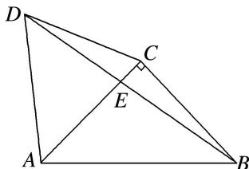

> [!faq]- 《专题8 多三角形问题-解三角形》例题解析
>
> > [!success]- **【答案】** 详见解析
>
> > [!note]- **【分析】**
> > 本题未单列分析。
>
> > [!note]- **【解析】**
> > (1)求 $\cos \angle CBE$ 的值；
> > (2)求 $AE$
> > 
> > 3. 解析
> > (1) $\because \angle BCD = 90^{\circ} + 60^{\circ} = 150^{\circ}$ , $CB = AC = CD$ , $\therefore \angle CBE = 15^{\circ}$ ,
> > $$
> > \therefore \cos \angle C B E = \cos (4 5 ^ {\circ} - 3 0 ^ {\circ}) = \frac {\sqrt {6} + \sqrt {2}}{4}.
> > $$
> > (2)在 $\triangle ABE$ 中， $AB = 2$ ，由正弦定理可得 $\frac{AE}{\sin(45^{\circ} - 15^{\circ})} = \frac{2}{\sin(90^{\circ} + 15^{\circ})}$ 得 $AE = \frac{2\sin 30^{\circ}}{\cos 15^{\circ}} = \frac{2\times\frac{1}{2}}{\frac{\sqrt{6} + \sqrt{2}}{4}} = \sqrt{6} -\sqrt{2}.$
