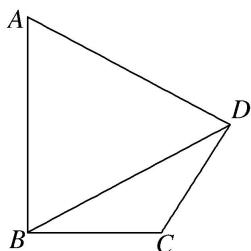

> [!faq]- 《专题8 多三角形问题-解三角形》例题解析
>
> > [!success]- **【答案】** CB
>
> > [!note]- **【分析】**
> > 本题未单列分析。
>
> > [!note]- **【解析】**
> > (1)求 $AD$ 的长;
> > (2)求 $\triangle CBD$ 的面积.
> > 
> > 7. 解析
> > (1)由已知 $S_{\triangle ABD}=\frac{1}{2}AB\cdot BD\cdot\sin\angle ABD=\frac{1}{2}\times2\times\sqrt{5}\times\sin\angle ABD=2$ ，可得 $\sin\angle ABD=\frac{2\sqrt{5}}{5}$ ,
> > 又 $\angle BCD = 2\angle ABD$ ，所以 $\angle ABD\in \left(0,\frac{\pi}{2}\right)$ ，所以 $\cos \angle ABD = \frac{\sqrt{5}}{5}.$
> > 在 $\triangle ABD$ 中，由余弦定理 $AD^{2}=AB^{2}+BD^{2}-2\cdot AB\cdot BD\cdot\cos\angle ABD$ ，可得 $AD^{2}=5$ ，所以 $AD=\sqrt{5}$ .
> > (2)由 $AB \perp BC$ ，得 $\angle ABD + \angle CBD = \frac{\pi}{2}$ ，所以 $\sin \angle CBD = \cos \angle ABD = \frac{\sqrt{5}}{5}$ .
> > 又 $\angle BCD = 2\angle ABD$ ，所以 $\sin \angle BCD = 2\sin \angle ABD\cdot \cos \angle ABD = \frac{4}{5},$
> > $$
> > \angle B D C = \pi - \angle C B D - \angle B C D = \pi - \left(\frac {\pi}{2} - \angle A B D\right) - 2 \angle A B D = \frac {\pi}{2} - \angle A B D = \angle C B D,
> > $$
> > 所以 $\triangle CBD$ 为等腰三角形，即CB=CD.
> > 在 $\triangle CBD$ 中，由正弦定理 $\frac{BD}{\sin\angle BCD}=\frac{CD}{\sin\angle CBD}$ ，得 $CD=\frac{BD\cdot\sin\angle CBD}{\sin\angle BCD}=\frac{\sqrt{5}\times\frac{\sqrt{5}}{5}}{\frac{4}{5}}=\frac{5}{4}$ ，
> > 所以 $S_{\triangle CBD}=\frac{1}{2}CB\cdot CD\cdot \sin\angle BCD=\frac{1}{2}\times\frac{5}{4}\times\frac{5}{4}\times\frac{4}{5}=\frac{5}{8}.$
