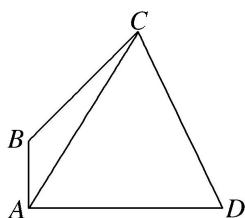

> [!faq]- 《专题8 多三角形问题-解三角形》例题解析
>
> > [!success]- **【答案】** 详见解析
>
> > [!note]- **【分析】**
> > 本题未单列分析。
>
> > [!note]- **【解析】**
> > (1)若 $AC=\sqrt{5}$ ，求 $\triangle ABC$ 的面积；
> > (2)若 $\angle ADC = \frac{\pi}{6}$ , $CD = 4$ , 求 $\sin \angle CAD$ .
> > 
> > 解析 (1)在 $\triangle ABC$ 中，由余弦定理得， $AC^{2}=AB^{2}+BC^{2}-2AB\cdot BC\cdot\cos\angle ABC,$
> > 即 $5 = 1 + BC^2 +\sqrt{2} BC$ ，解得 $BC = \sqrt{2}$ ，所以△ABC的面积 $S_{\triangle ABC} = \frac{1}{2} AB\cdot BC\cdot \sin \angle ABC = \frac{1}{2}\times 1\times \sqrt{2}\times \frac{\sqrt{2}}{2} = \frac{1}{2}.$
> > (2)设 $\angle CAD=\theta$ ，在 $\triangle ACD$ 中，由正弦定理得 $\frac{AC}{\sin\angle ADC}=\frac{CD}{\sin\angle CAD}$ ，即 $\frac{AC}{\sin\frac{\pi}{6}}=\frac{4}{\sin\theta}$ ，①
> > 在 $\triangle ABC$ 中， $\angle BAC=\frac{\pi}{2}-\theta,\quad\angle BCA=\pi-\frac{3\pi}{4}-\left(\frac{\pi}{2}-\theta\right)=\theta-\frac{\pi}{4},$
> > 由正弦定理得 $\frac{AC}{\sin\angle ABC}=\frac{AB}{\sin\angle BCA}$ ，即 $\frac{AC}{\sin\frac{3\pi}{4}}=\frac{1}{\sin\left(\theta-\frac{\pi}{4}\right)}$ ，②
> > - **①**：②两式相除，得 $\frac{\sin\frac{3\pi}{4}}{\sin\frac{\pi}{6}}=\frac{4\sin\left(\theta-\frac{\pi}{4}\right)}{\sin\theta}$ ，即 $4\left(\frac{\sqrt{2}}{2}\sin\theta-\frac{\sqrt{2}}{2}\cos\theta\right)=\sqrt{2}\sin\theta,$
> > 整理得 $\sin \theta = 2\cos \theta$ 。又因为 $\sin^2\theta + \cos^2\theta = 1$ ，所以 $\sin \theta = \frac{2\sqrt{5}}{5}$ ，即 $\sin \angle CAD = \frac{2\sqrt{5}}{5}$ 。
